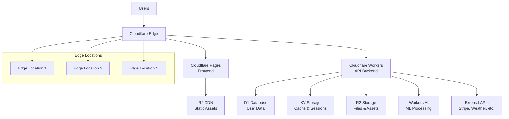

# Fataplus Cloudflare Deployment Guide

## Overview

This guide provides comprehensive instructions for deploying the Fataplus AgriTech Platform to Cloudflare's edge infrastructure, including Workers, Pages, R2 storage, D1 database, and KV storage.

## Table of Contents

1. [Prerequisites](#prerequisites)
2. [Quick Start](#quick-start)
3. [Architecture Overview](#architecture-overview)
4. [Configuration](#configuration)
5. [Deployment Process](#deployment-process)
6. [Service Configuration](#service-configuration)
7. [Monitoring and Management](#monitoring-and-management)
8. [Security Considerations](#security-considerations)
9. [Troubleshooting](#troubleshooting)
10. [Cost Optimization](#cost-optimization)

## Prerequisites

### Required Accounts and Tools

- ✅ **Cloudflare Account** with Pro plan or higher (for advanced features)
- ✅ **Domain** added to Cloudflare (for custom domains)
- ✅ **Node.js 18+** installed locally
- ✅ **Wrangler CLI** installed and authenticated
- ✅ **Git** for version control

### Cloudflare Service Requirements

- 🔧 **Workers** - For backend API endpoints
- 🔧 **Pages** - For frontend hosting
- 🔧 **R2** - For file storage
- 🔧 **D1** - For database (optional, can use external PostgreSQL)
- 🔧 **KV** - For caching and session storage
- 🔧 **Analytics Engine** - For application metrics

### Installation Steps

```bash
# Install Wrangler CLI globally
npm install -g wrangler

# Authenticate with Cloudflare
wrangler login

# Verify authentication
wrangler whoami

# Clone the repository
git clone <repository-url>
cd fataplus-agritech-platform

# Copy environment template
cp .env.cloudflare.example .env.cloudflare
```

## Quick Start

### 1. Initialize Cloudflare Resources

```bash
# Set up environment and secrets management
./cloudflare-secrets.sh init

# Configure your .env.cloudflare file with your account details
nano .env.cloudflare

# Deploy to Cloudflare (staging first)
./deploy-cloudflare.sh -e staging

# Deploy to production
./deploy-cloudflare.sh -e production
```

### 2. Access Your Application

- **Frontend**: `https://your-app-domain.com`
- **API**: `https://api.your-domain.com`
- **Admin**: `https://admin.your-domain.com`

## Architecture Overview

### Cloudflare Infrastructure Components



### Service Mapping

| Component | Cloudflare Service | Purpose |
|-----------|-------------------|---------|
| Frontend | Cloudflare Pages | Static site hosting with SSG/SSR |
| Backend API | Cloudflare Workers | Edge API endpoints |
| AI Services | Workers AI | Machine learning inference |
| Database | D1 / External PostgreSQL | Persistent data storage |
| Cache | KV Storage | Session data and application cache |
| File Storage | R2 Storage | User uploads and static assets |
| CDN | Cloudflare CDN | Global content delivery |
| Analytics | Analytics Engine | Application metrics and logs |

## Configuration

### Environment Variables

Create and configure your `.env.cloudflare` file:

```bash
# Copy the template
cp .env.cloudflare.example .env.cloudflare

# Edit with your values
nano .env.cloudflare
```

Key configuration sections:

#### Account Configuration
```bash
CF_ACCOUNT_ID=your-account-id
CF_API_TOKEN=your-api-token
CF_ZONE_ID=your-zone-id
```

#### Domain Configuration
```bash
CF_WORKER_CUSTOM_DOMAIN=api.yourdomain.com
CF_PAGES_CUSTOM_DOMAIN=app.yourdomain.com
R2_PUBLIC_URL=https://storage.yourdomain.com
```

#### Storage Configuration
```bash
R2_BUCKET_NAME=fataplus-storage
CF_D1_DATABASE_NAME=fataplus-db
CF_KV_NAMESPACE_NAME=fataplus-cache
```

### Secrets Management

Use the built-in secrets management system:

```bash
# Initialize secrets management
./cloudflare-secrets.sh init

# Set sensitive values
./cloudflare-secrets.sh set -k JWT_SECRET_KEY -v "your-secret" --encrypt
./cloudflare-secrets.sh set -k STRIPE_SECRET_KEY -v "sk_live_..." --encrypt

# Sync secrets to Cloudflare services
./cloudflare-secrets.sh sync -s all -e production
```

## Deployment Process

### Automated Deployment

The deployment script handles the complete process:

```bash
# Deploy to development
./deploy-cloudflare.sh -e dev

# Deploy to staging (with tests)
./deploy-cloudflare.sh -e staging

# Deploy to production (with confirmation)
./deploy-cloudflare.sh -e production

# Force deploy without tests
./deploy-cloudflare.sh -e production -s -f
```

### Manual Deployment Steps

If you prefer manual control:

#### 1. Set Up Cloudflare Resources

```bash
# Create R2 buckets
wrangler r2 bucket create fataplus-storage
wrangler r2 bucket create fataplus-ml-models
wrangler r2 bucket create fataplus-backups

# Create D1 database
wrangler d1 create fataplus-db

# Create KV namespaces
wrangler kv:namespace create fataplus-cache
wrangler kv:namespace create fataplus-sessions
```

#### 2. Deploy Backend Workers

```bash
cd web-backend

# Configure wrangler.toml
cp ../infrastructure/cloudflare/wrangler.toml ./

# Deploy worker
wrangler deploy --env production
```

#### 3. Deploy Frontend to Pages

```bash
cd web-frontend

# Build application
npm run build

# Deploy to Pages
wrangler pages deploy out --project-name fataplus-frontend
```

#### 4. Configure Custom Domains

```bash
# Add custom domain to Pages
wrangler pages project domain add fataplus-frontend app.yourdomain.com

# Add custom domain to Workers
wrangler custom-domains add api.yourdomain.com
```

## Service Configuration

### Cloudflare Workers (Backend API)

**Configuration File**: `infrastructure/cloudflare/wrangler.toml`

Key features:
- Edge-optimized API endpoints
- Automatic scaling
- Built-in DDoS protection
- Global distribution

**Environment Variables**:
```toml
[env.production]
vars = { 
  ENVIRONMENT = "production",
  LOG_LEVEL = "warn",
  CORS_ORIGINS = "https://yourdomain.com"
}
```

**Resource Bindings**:
```toml
[[d1_databases]]
binding = "DB"
database_name = "fataplus-db"

[[kv_namespaces]]
binding = "CACHE"
id = "your-kv-namespace-id"

[[r2_buckets]]
binding = "STORAGE"
bucket_name = "fataplus-storage"
```

### Cloudflare Pages (Frontend)

**Configuration File**: `infrastructure/cloudflare/pages.toml`

Key features:
- Static site generation
- Preview deployments
- Automatic HTTPS
- Git integration

**Build Settings**:
```toml
[build]
command = "npm run build"
publish = "out"

[build.environment]
NODE_VERSION = "18"
```

**Environment Variables by Branch**:
```toml
[env.production]
NEXT_PUBLIC_API_URL = "https://api.yourdomain.com"

[env.staging]
NEXT_PUBLIC_API_URL = "https://staging-api.yourdomain.com"
```

### R2 Storage Configuration

**Setup Script**: `infrastructure/cloudflare/r2-manage.sh`

Key features:
- S3-compatible API
- Global distribution
- Zero egress fees
- Automatic backups

**CORS Configuration**:
```json
{
  "CORSRules": [
    {
      "AllowedOrigins": ["https://yourdomain.com"],
      "AllowedMethods": ["GET", "POST", "PUT", "DELETE"],
      "AllowedHeaders": ["*"],
      "MaxAgeSeconds": 3600
    }
  ]
}
```

**Lifecycle Rules**:
```json
{
  "Rules": [
    {
      "ID": "temp-files-cleanup",
      "Status": "Enabled",
      "Filter": { "Prefix": "temp/" },
      "Expiration": { "Days": 7 }
    }
  ]
}
```

### D1 Database Configuration

**Schema Initialization**:
```bash
# Execute schema
wrangler d1 execute fataplus-db --file ./infrastructure/docker/postgres/init.sql

# Run migrations
wrangler d1 migrations apply fataplus-db
```

**Backup Strategy**:
```bash
# Daily backup
wrangler d1 export fataplus-db --output backup-$(date +%Y%m%d).sql

# Store backup in R2
wrangler r2 object put fataplus-backups/db/backup-$(date +%Y%m%d).sql --file backup-$(date +%Y%m%d).sql
```

### KV Storage Configuration

**Namespace Usage**:
- `fataplus-cache`: Application cache
- `fataplus-sessions`: User sessions
- `fataplus-config`: Application configuration

**Management Commands**:
```bash
# Set configuration
./cloudflare-manage.sh kv put RATE_LIMIT_WINDOW 900

# Get cached data
./cloudflare-manage.sh kv get user:123:profile

# Bulk upload
./cloudflare-manage.sh kv bulk config-data.json
```

## Monitoring and Management

### Health Monitoring

The deployment includes comprehensive health checks:

```bash
# Check overall status
./cloudflare-manage.sh status

# Monitor real-time
./cloudflare-manage.sh monitor

# View logs
./cloudflare-manage.sh logs
```

### Performance Metrics

Access metrics through:
- **Cloudflare Analytics**: Traffic and performance
- **Workers Analytics**: Function execution metrics
- **R2 Analytics**: Storage usage and access patterns

### Log Management

**Real-time Logs**:
```bash
# Stream Worker logs
wrangler tail fataplus-api --env production

# Pages deployment logs
wrangler pages deployment list --project-name fataplus-frontend
```

**Log Storage**:
- Logs are automatically shipped to R2 bucket: `fataplus-logs`
- Retention: 90 days for error logs, 30 days for access logs
- Format: JSON with structured fields

### Cache Management

```bash
# Purge all cache
./cloudflare-manage.sh cache purge

# Warm cache for key pages
./cloudflare-manage.sh cache warm

# View cache statistics
./cloudflare-manage.sh cache status
```

### Storage Management

```bash
# View storage statistics
./infrastructure/cloudflare/r2-manage.sh stats

# Clean up old files
./infrastructure/cloudflare/r2-manage.sh cleanup -d 30

# Backup storage
./infrastructure/cloudflare/r2-manage.sh backup
```

## Security Considerations

### Authentication and Authorization

- **JWT Tokens**: Secure token-based authentication
- **API Rate Limiting**: Automatic DDoS protection
- **CORS Configuration**: Strict origin controls
- **Secure Headers**: Automatic security header injection

### Data Protection

- **Encryption at Rest**: All R2 data encrypted
- **TLS Everywhere**: Automatic HTTPS/TLS termination
- **Secret Management**: Encrypted secret storage
- **Data Isolation**: Tenant data separation

### Access Control

```bash
# API token with minimal permissions
CF_API_TOKEN_PERMISSIONS=
  - Zone:Zone Settings:Read
  - Zone:Zone:Read
  - Zone:DNS:Edit
  - Workers:Workers Scripts:Edit
  - Workers:Workers KV Storage:Edit
  - R2:R2 Object Storage:Edit
  - D1:D1 Database:Edit
```

### Security Headers

Automatically applied headers:
- `Content-Security-Policy`
- `X-Frame-Options: DENY`
- `X-Content-Type-Options: nosniff`
- `Strict-Transport-Security`
- `Referrer-Policy`

## Troubleshooting

### Common Issues

#### Worker Deployment Fails
```bash
# Check account limits
wrangler whoami

# Verify wrangler.toml syntax
wrangler config

# Check bindings
wrangler kv:namespace list
wrangler r2 bucket list
```

#### Pages Build Fails
```bash
# Check build logs
wrangler pages deployment list --project-name fataplus-frontend

# Local build test
npm run build

# Environment variable issues
wrangler pages project show fataplus-frontend
```

#### Database Connection Issues
```bash
# Test D1 connection
wrangler d1 execute fataplus-db --command "SELECT 1"

# Check database schema
wrangler d1 info fataplus-db

# External database connectivity test
curl -X POST api.yourdomain.com/health
```

#### Storage Access Issues
```bash
# Test R2 access
wrangler r2 object list fataplus-storage

# Check CORS configuration
curl -H "Origin: https://yourdomain.com" https://storage.yourdomain.com

# Verify bucket permissions
./infrastructure/cloudflare/r2-manage.sh cors
```

### Debug Mode

Enable detailed logging:

```bash
# Deploy with debug mode
DEBUG=true ./deploy-cloudflare.sh -e staging

# Verbose logging
LOG_LEVEL=debug ./cloudflare-manage.sh status

# Worker debug logs
wrangler tail fataplus-api --debug
```

### Error Recovery

#### Rollback Deployment
```bash
# Rollback to previous version
./cloudflare-manage.sh rollback production

# Specific Pages deployment
wrangler pages deployment promote fataplus-frontend <deployment-id>
```

#### Restore from Backup
```bash
# List available backups
./infrastructure/cloudflare/r2-manage.sh backup list

# Restore from backup
./cloudflare-manage.sh restore backup-20240101-120000
```

## Cost Optimization

### Free Tier Limits

**Workers**:
- 100,000 requests/day (free)
- 10ms CPU time/request (free)
- Additional requests: $0.50/million

**Pages**:
- 1 build/month (free)
- 500 builds/month: $1/build
- Unlimited bandwidth

**R2**:
- 10GB storage/month (free)
- 1 million Class A operations (free)
- 10 million Class B operations (free)

**D1**:
- 5 million queries/month (free)
- 5GB storage (free)
- Additional usage: $0.001/query

### Cost Monitoring

```bash
# View usage statistics
./cloudflare-manage.sh stats

# R2 usage breakdown
./infrastructure/cloudflare/r2-manage.sh stats

# Optimize storage
./infrastructure/cloudflare/r2-manage.sh cleanup --dry-run
```

### Optimization Strategies

1. **Enable Compression**: Automatic Gzip/Brotli
2. **Optimize Images**: Use Cloudflare Image Optimization
3. **Cache Aggressively**: Set appropriate TTL values
4. **Use KV for Caching**: Reduce database queries
5. **Implement Rate Limiting**: Prevent abuse

### Example Cost Calculation

For a medium-scale deployment:
- **Workers**: $5/month (1M requests)
- **Pages**: $20/month (unlimited builds)
- **R2**: $15/month (300GB storage)
- **D1**: $5/month (50M queries)
- **KV**: $5/month (10M operations)

**Total**: ~$50/month for global edge deployment

## Advanced Configuration

### Custom Domains with SSL

```bash
# Add custom domain
wrangler custom-domains add api.yourdomain.com

# Verify SSL certificate
curl -I https://api.yourdomain.com

# Configure DNS
# Add CNAME record: api.yourdomain.com -> your-worker.your-subdomain.workers.dev
```

### Advanced Caching

```javascript
// Custom cache key in Worker
const cacheKey = new Request(
  `https://cache.example.com/${request.url}?${await request.text()}`,
  {
    method: 'GET',
    headers: {
      'content-type': 'application/json',
    },
  }
);
```

### Geographic Restrictions

```javascript
// Geo-blocking in Worker
const country = request.cf.country;
if (blockedCountries.includes(country)) {
  return new Response('Access denied', { status: 403 });
}
```

### A/B Testing

```javascript
// Feature flags with KV
const featureFlags = await env.CONFIG_KV.get('feature_flags');
const flags = JSON.parse(featureFlags);

if (flags.newFeature && Math.random() < 0.5) {
  // Serve new feature
}
```

## Support and Resources

### Documentation
- 📚 [Cloudflare Workers Docs](https://developers.cloudflare.com/workers/)
- 📚 [Cloudflare Pages Docs](https://developers.cloudflare.com/pages/)
- 📚 [R2 Storage Docs](https://developers.cloudflare.com/r2/)
- 📚 [D1 Database Docs](https://developers.cloudflare.com/d1/)

### Community Resources
- 💬 [Cloudflare Discord](https://discord.gg/cloudflaredev)
- 🐛 [GitHub Issues](https://github.com/your-org/fataplus-agritech/issues)
- 📧 [Support Email](mailto:support@yourdomain.com)

### Professional Support
- 🏢 [Cloudflare Enterprise Support](https://www.cloudflare.com/enterprise/)
- 👥 [Professional Services](https://www.cloudflare.com/professional-services/)

---

## 🎉 Deployment Complete!

Your Fataplus AgriTech Platform is now running on Cloudflare's global edge network!

### Quick Health Check
```bash
# Verify deployment
curl https://api.yourdomain.com/health
curl https://app.yourdomain.com

# Check all services
./cloudflare-manage.sh status
```

### Next Steps
1. ✅ Configure monitoring and alerts
2. ✅ Set up automated backups
3. ✅ Configure custom domains
4. ✅ Optimize performance settings
5. ✅ Set up CI/CD pipeline integration

**Welcome to the edge! 🚀🌍**