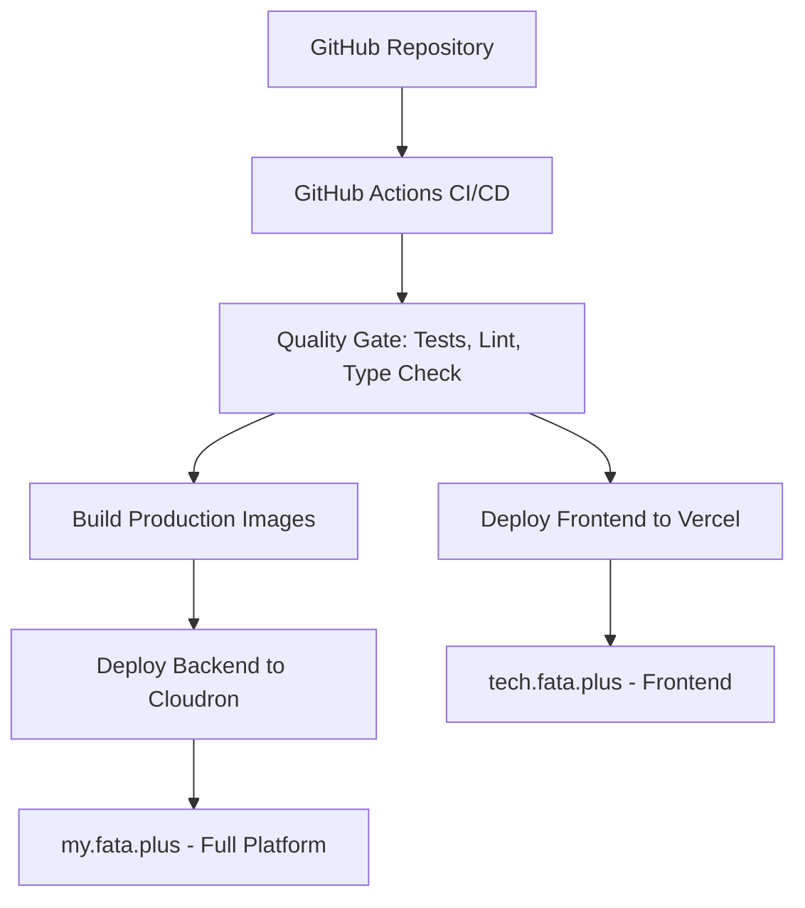

# 🚀 Complete CI/CD Setup with Vercel Integration

## 📊 **Current Deployment Architecture**

### 🌐 **Multi-Environment Deployment**



### ✅ **What's Deployed Where**

| Environment | URL | Content | Auto-Deploy |
|-------------|-----|---------|-------------|
| **Vercel Production** | https://tech.fata.plus | Frontend Only (New Muse Hero) | ✅ Yes |
| **Cloudron Production** | https://my.fata.plus | Full Platform (Frontend + Backend + APIs) | ✅ Yes |

## 🔧 **CI/CD Pipeline Jobs**

### 1. **Quality Gate** (All Pushes)
- ✅ Frontend: Lint, Type Check, Build, Test
- ✅ Backend: Lint, Type Check, Test
- ✅ AI Services: Test, Security Scan
- ✅ Mobile App: Build, Test

### 2. **Vercel Deployment** (Main Branch Only)
- ✅ **Trigger**: Push to `main` branch
- ✅ **Target**: https://tech.fata.plus
- ✅ **Content**: Frontend with new Muse-inspired hero
- ✅ **Features**: 
  - Custom domain setup
  - Health checks
  - Slack notifications
  - Environment variables

### 3. **Cloudron Deployment** (Main Branch Only)
- ✅ **Trigger**: Push to `main` branch  
- ✅ **Target**: https://my.fata.plus
- ✅ **Content**: Full platform (Docker containers)
- ✅ **Features**:
  - Docker image building
  - SSH deployment
  - Health checks
  - Integration tests

## ⚙️ **Required Secrets Configuration**

### 🔐 **Vercel Secrets** (For tech.fata.plus)
Add these to GitHub Repository → Settings → Secrets and Variables → Actions:

```bash
VERCEL_TOKEN=your_vercel_api_token
VERCEL_ORG_ID=your_organization_id
VERCEL_PROJECT_ID=your_project_id
```

**How to get these values:**
1. **VERCEL_TOKEN**: Vercel Dashboard → Settings → Tokens → Create Token
2. **VERCEL_ORG_ID**: Vercel Dashboard → Settings → General → Organization ID  
3. **VERCEL_PROJECT_ID**: Project Settings → General → Project ID

### 🔐 **Existing Secrets** (For my.fata.plus)
```bash
CLOUDRON_SSH_PRIVATE_KEY=ssh_private_key
CLOUDRON_HOST=your_cloudron_host
CLOUDRON_USER=your_ssh_user
CLOUDRON_APP_ID=cloudron_app_id
CLOUDRON_DOMAIN=my.fata.plus
CLOUDRON_ACCESS_TOKEN=cloudron_api_token
SLACK_WEBHOOK_URL=slack_webhook_for_notifications
```

## 🚀 **Deployment Workflow**

### **Automatic Deployment** (Current Setup)
```bash
# Every push to main triggers BOTH deployments:

1. Developer pushes to main
   ↓
2. GitHub Actions starts CI/CD
   ↓
3. Quality Gate (tests, lint, build)
   ↓
4. Parallel Deployment:
   ├── Vercel: Deploys frontend to tech.fata.plus
   └── Cloudron: Deploys full platform to my.fata.plus
   ↓
5. Health checks and notifications
```

### **Manual Deployment**
```bash
# Trigger manual deployment:
gh workflow run ci.yml --field environment=production
```

## 📋 **Verification Commands**

### **Check Deployment Status**
```bash
# Vercel deployment
curl -I https://tech.fata.plus
curl -s https://tech.fata.plus | grep -i "agricultural clarity"

# Cloudron deployment  
curl -I https://my.fata.plus
curl https://my.fata.plus/health
curl https://my.fata.plus/api/health
```

### **Check CI/CD Status**
```bash
# View recent deployments
gh run list --workflow=ci.yml --limit 5

# View specific run
gh run view <run_id>

# View logs
gh run view <run_id> --log
```

## 🎯 **Environment Variables**

### **Vercel Environment**
```env
NEXT_PUBLIC_API_URL=https://api.fata.plus
NEXT_PUBLIC_AI_API_URL=https://ai.fata.plus
```

### **Build Environment**
```env
NODE_VERSION=18
PYTHON_VERSION=3.11
```

## 🔍 **Monitoring & Notifications**

### **Health Checks**
- ✅ Frontend response (200 OK)
- ✅ Hero section content verification
- ✅ API endpoint testing
- ✅ Authentication endpoint testing

### **Slack Notifications**
- 📢 Deployment start/completion
- ❌ Failure alerts
- ✅ Success confirmations
- 📊 Deployment metrics

## 🛠️ **Troubleshooting**

### **Common Issues**

1. **Vercel Deployment Fails**
   ```bash
   # Check secrets are configured
   gh secret list
   
   # Check build logs
   gh run view --log
   ```

2. **Domain Not Working**
   ```bash
   # Check DNS configuration
   dig tech.fata.plus
   
   # Check Vercel domain status
   vercel domains ls
   ```

3. **Build Failures**
   ```bash
   # Test locally
   cd web-frontend
   npm run build
   
   # Check environment variables
   echo $NEXT_PUBLIC_API_URL
   ```

## 🎨 **What's Live Now**

### **tech.fata.plus** (Vercel)
- ✅ **New Muse-inspired hero section**
- ✅ **"Your Shortcut To Agricultural Clarity"**
- ✅ **Thought capture interface**
- ✅ **Peaceful landscape design**
- ✅ **Save/Analyze buttons**
- ✅ **Agricultural quick actions**

### **my.fata.plus** (Cloudron)
- ✅ **Full platform with APIs**
- ✅ **Authentication system**
- ✅ **Backend services**
- ✅ **MCP server**
- ✅ **AI services**

## 📈 **Next Steps**

1. **Configure Vercel secrets** to enable automatic deployment
2. **Test the CI/CD pipeline** with a small change
3. **Monitor deployments** through GitHub Actions
4. **Set up additional environments** (staging, develop)

---

🌱 **Fataplus** - Now with seamless CI/CD to both Vercel and Cloudron platforms!