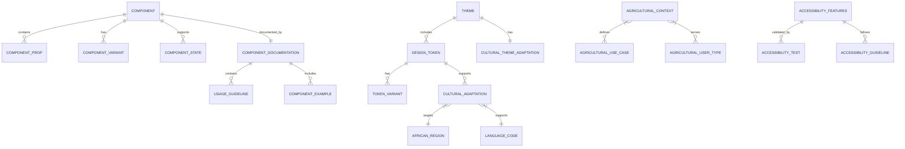

# Data Model: Fataplus Design System

**Feature Branch**: `002-fataplus-design-system`  
**Created**: 2025-01-09  
**Status**: Draft  

---

## Overview

This document defines the data structures and interfaces that support the Fataplus Design System. While the design system is primarily a UI component library, it requires structured data models for design tokens, component configurations, cultural adaptations, and documentation management.

## Core Data Models

### Design Tokens

#### Base Token Structure
```typescript
interface DesignToken {
  id: string;
  name: string;
  value: string | number;
  category: TokenCategory;
  description?: string;
  deprecated?: boolean;
  version: string;
  metadata: TokenMetadata;
}

interface TokenMetadata {
  source: 'base' | 'semantic' | 'component';
  platform: Platform[];
  accessibility: AccessibilityInfo;
  cultural: CulturalAdaptation[];
}

type TokenCategory = 
  | 'color'
  | 'spacing'
  | 'typography'
  | 'shadow'
  | 'border'
  | 'animation'
  | 'agricultural';

type Platform = 'web' | 'mobile' | 'desktop' | 'print';
```

#### Color Token Model
```typescript
interface ColorToken extends DesignToken {
  category: 'color';
  value: string; // Hex, HSL, or RGB
  variants: ColorVariant[];
  accessibility: ColorAccessibility;
  agricultural: AgriculturalColorContext;
}

interface ColorVariant {
  name: string; // e.g., '50', '100', '500', '900'
  value: string;
  contrast: ContrastLevel;
}

interface ColorAccessibility {
  wcagCompliance: 'AA' | 'AAA';
  contrastRatio: number;
  colorBlindSafe: boolean;
  highContrastAlternative?: string;
}

interface AgriculturalColorContext {
  season?: 'planting' | 'growing' | 'harvest' | 'dormant';
  crop?: string[];
  livestock?: string[];
  equipment?: string[];
  meaning: string; // Cultural significance
}
```

#### Typography Token Model
```typescript
interface TypographyToken extends DesignToken {
  category: 'typography';
  fontFamily: string;
  fontSize: string | number;
  fontWeight: number;
  lineHeight: number;
  letterSpacing?: number;
  textTransform?: 'none' | 'uppercase' | 'lowercase' | 'capitalize';
  languages: LanguageSupport[];
}

interface LanguageSupport {
  language: LanguageCode;
  script: Script;
  fontFamily?: string; // Override for specific languages
  scaleFactor?: number; // Text scaling for readability
  direction: 'ltr' | 'rtl';
}

type LanguageCode = 'en' | 'fr' | 'ar' | 'sw' | 'mg' | 'pt';
type Script = 'latin' | 'arabic' | 'cyrillic';
```

### Component Models

#### Component Definition
```typescript
interface ComponentDefinition {
  id: string;
  name: string;
  category: ComponentCategory;
  description: string;
  props: ComponentProp[];
  variants: ComponentVariant[];
  states: ComponentState[];
  accessibility: AccessibilityFeatures;
  cultural: CulturalAdaptation[];
  agricultural: AgriculturalContext;
  documentation: ComponentDocumentation;
}

type ComponentCategory = 
  | 'core'           // Basic UI elements
  | 'layout'         // Layout and container components
  | 'navigation'     // Navigation components
  | 'form'           // Form and input components
  | 'display'        // Data display components
  | 'feedback'       // Alerts, notifications, loading states
  | 'agricultural'   // Agriculture-specific components
  | 'pattern';       // Complex UI patterns

interface ComponentProp {
  name: string;
  type: PropType;
  required: boolean;
  default?: any;
  description: string;
  examples: PropExample[];
  agricultural?: AgriculturalPropContext;
}

type PropType = 
  | 'string'
  | 'number'
  | 'boolean'
  | 'enum'
  | 'object'
  | 'array'
  | 'function'
  | 'node';
```

#### Agricultural Component Context
```typescript
interface AgriculturalContext {
  useCases: AgriculturalUseCase[];
  crops?: string[];
  livestock?: string[];
  seasons?: Season[];
  regions?: AfricanRegion[];
  userTypes: AgriculturalUserType[];
}

interface AgriculturalUseCase {
  id: string;
  name: string;
  description: string;
  scenario: string;
  users: AgriculturalUserType[];
  example: string; // Code example
}

type AgriculturalUserType = 
  | 'farmer'
  | 'cooperative_member'
  | 'agricultural_business'
  | 'extension_worker'
  | 'researcher'
  | 'policy_maker';

type Season = 'planting' | 'growing' | 'harvest' | 'dormant';

type AfricanRegion = 
  | 'west_africa'
  | 'east_africa'
  | 'southern_africa'
  | 'north_africa'
  | 'central_africa';
```

### Cultural Adaptation Models

#### Cultural Configuration
```typescript
interface CulturalAdaptation {
  region: AfricanRegion;
  country?: string;
  language: LanguageCode;
  script: Script;
  direction: 'ltr' | 'rtl';
  adaptations: CulturalElementAdaptation[];
}

interface CulturalElementAdaptation {
  element: 'color' | 'icon' | 'image' | 'text' | 'layout';
  original: string;
  adapted: string;
  reason: string;
  culturalNote: string;
}

interface CulturalGuideline {
  id: string;
  title: string;
  description: string;
  region: AfricanRegion[];
  category: 'color' | 'imagery' | 'typography' | 'layout' | 'interaction';
  guideline: string;
  examples: CulturalExample[];
  sensitivity: 'low' | 'medium' | 'high';
}

interface CulturalExample {
  description: string;
  doExample?: string;
  dontExample?: string;
  explanation: string;
}
```

### Accessibility Models

#### Accessibility Features
```typescript
interface AccessibilityFeatures {
  wcagLevel: 'A' | 'AA' | 'AAA';
  supports: AccessibilitySupport[];
  testing: AccessibilityTest[];
  guidelines: AccessibilityGuideline[];
}

interface AccessibilitySupport {
  technology: 'screen_reader' | 'keyboard' | 'voice_control' | 'switch' | 'eye_tracking';
  level: 'full' | 'partial' | 'none';
  notes?: string;
}

interface AccessibilityTest {
  type: 'automated' | 'manual';
  tool?: string;
  criteria: string;
  expected: string;
}

interface AccessibilityGuideline {
  wcagCriterion: string;
  level: 'A' | 'AA' | 'AAA';
  description: string;
  implementation: string;
  testProcedure: string;
}
```

### Documentation Models

#### Component Documentation
```typescript
interface ComponentDocumentation {
  overview: string;
  usage: UsageGuideline[];
  examples: ComponentExample[];
  apiReference: APIReference;
  accessibility: AccessibilityDocumentation;
  cultural: CulturalUsageGuideline[];
  agricultural: AgriculturalUsageGuideline[];
  changelog: ChangelogEntry[];
}

interface UsageGuideline {
  title: string;
  description: string;
  when: string; // When to use this component
  whenNot: string; // When not to use this component
  codeExample: string;
  preview?: string; // Image or interactive preview
}

interface ComponentExample {
  title: string;
  description: string;
  code: string;
  language: 'typescript' | 'jsx';
  category: 'basic' | 'advanced' | 'agricultural' | 'cultural';
  userType?: AgriculturalUserType;
  region?: AfricanRegion;
}

interface AgriculturalUsageGuideline {
  context: AgriculturalContext;
  recommendation: string;
  example: string;
  considerations: string[];
}
```

### Theme and Theming Models

#### Theme Configuration
```typescript
interface Theme {
  id: string;
  name: string;
  description: string;
  baseTheme?: string; // Parent theme ID
  tokens: Record<string, any>; // Design token values
  cultural: CulturalThemeAdaptation;
  agricultural: AgriculturalThemeContext;
  accessibility: AccessibilityThemeFeatures;
}

interface CulturalThemeAdaptation {
  region: AfricanRegion;
  language: LanguageCode;
  adaptations: ThemeAdaptation[];
  culturalElements: CulturalThemeElement[];
}

interface ThemeAdaptation {
  tokenId: string;
  originalValue: any;
  adaptedValue: any;
  reason: string;
}

interface CulturalThemeElement {
  type: 'color_palette' | 'icon_set' | 'imagery' | 'typography';
  elements: string[];
  culturalSignificance: string;
}

interface AgriculturalThemeContext {
  seasons: Season[];
  primaryCrops: string[];
  primaryLivestock: string[];
  farmingPractices: string[];
  visualElements: AgriculturalVisualElement[];
}

interface AgriculturalVisualElement {
  type: 'color' | 'icon' | 'pattern' | 'imagery';
  element: string;
  meaning: string;
  usage: string[];
}
```

### Performance and Analytics Models

#### Component Performance Metrics
```typescript
interface ComponentPerformance {
  componentId: string;
  metrics: PerformanceMetric[];
  bundleSize: BundleSize;
  renderMetrics: RenderMetrics;
  accessibility: AccessibilityMetrics;
}

interface PerformanceMetric {
  metric: 'load_time' | 'render_time' | 'interactive_time' | 'bundle_size';
  value: number;
  unit: string;
  context: PerformanceContext;
  timestamp: Date;
}

interface PerformanceContext {
  device: 'desktop' | 'tablet' | 'mobile' | 'feature_phone';
  connection: '4g' | '3g' | '2g' | 'offline';
  region?: AfricanRegion;
}

interface BundleSize {
  gzipped: number;
  minified: number;
  raw: number;
  dependencies: DependencySize[];
}

interface AccessibilityMetrics {
  wcagScore: number;
  violations: AccessibilityViolation[];
  testCoverage: number;
}
```

### Usage Analytics Models

#### Design System Analytics
```typescript
interface DesignSystemUsage {
  timeframe: DateRange;
  components: ComponentUsage[];
  tokens: TokenUsage[];
  themes: ThemeUsage[];
  regions: RegionalUsage[];
  performance: PerformanceAnalytics;
}

interface ComponentUsage {
  componentId: string;
  usageCount: number;
  applications: string[];
  variants: VariantUsage[];
  issues: UsageIssue[];
}

interface RegionalUsage {
  region: AfricanRegion;
  components: ComponentUsage[];
  cultural: CulturalUsageMetrics;
  performance: RegionalPerformanceMetrics;
}

interface CulturalUsageMetrics {
  languageAdoption: LanguageAdoptionMetric[];
  culturalAdaptationUsage: CulturalAdaptationUsage[];
  accessibilityFeatureUsage: AccessibilityFeatureUsage[];
}
```

## Data Relationships

### Entity Relationship Diagram



## Data Storage and Management

### Design Token Storage
- **Format**: JSON files organized by category and platform
- **Structure**: Hierarchical token organization with inheritance
- **Versioning**: Semantic versioning for token changes
- **Distribution**: Build-time generation of platform-specific formats

### Component Metadata
- **Storage**: TypeScript definition files with metadata decorators
- **Documentation**: Markdown files with structured frontmatter
- **Examples**: Separate example files with runnable code snippets
- **Testing**: Test files with accessibility and performance benchmarks

### Cultural Data
- **Guidelines**: YAML files with cultural adaptation rules
- **Translations**: JSON files for component text and descriptions
- **Regional Config**: JSON configuration files per African region
- **Icon Assets**: SVG files organized by cultural context

### Performance Data
- **Metrics**: Time-series data stored in JSON format
- **Benchmarks**: Baseline performance measurements
- **Reports**: Generated HTML reports with visualizations
- **Alerts**: Configuration for performance regression detection

## Data Validation

### Schema Validation
```typescript
// Example schema for component validation
const ComponentSchema = z.object({
  id: z.string().min(1),
  name: z.string().min(1),
  category: z.enum(['core', 'layout', 'navigation', 'form', 'display', 'feedback', 'agricultural', 'pattern']),
  props: z.array(ComponentPropSchema),
  accessibility: AccessibilityFeaturesSchema,
  agricultural: AgriculturalContextSchema.optional(),
});

const AccessibilityFeaturesSchema = z.object({
  wcagLevel: z.enum(['A', 'AA', 'AAA']),
  supports: z.array(AccessibilitySupportSchema),
  testing: z.array(AccessibilityTestSchema),
});
```

### Data Quality Rules
- **Token Consistency**: All color tokens must meet minimum contrast requirements
- **Component Completeness**: All components must have documentation and examples
- **Accessibility Compliance**: All components must pass WCAG 2.1 AA validation
- **Cultural Sensitivity**: All cultural adaptations must be reviewed by regional experts
- **Performance Standards**: All components must meet mobile performance benchmarks

---

*This data model provides the structural foundation for building, documenting, and maintaining the Fataplus Design System with comprehensive support for African agricultural contexts, cultural adaptation, and accessibility requirements.*