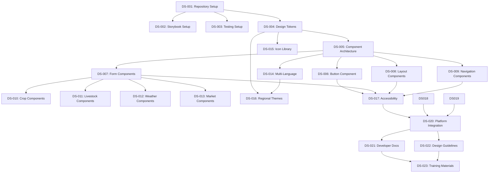

# Development Tasks: Fataplus Design System

**Feature Branch**: `002-fataplus-design-system`  
**Created**: 2025-01-09  
**Status**: Draft  

---

## Task Breakdown Structure

### Phase 1: Foundation Setup (Weeks 1-4)

#### 1.1 Project Infrastructure
- **Task ID**: DS-001
- **Title**: Design System Repository Setup
- **Description**: Initialize design system monorepo structure with build tools and development environment
- **Acceptance Criteria**:
  - [ ] Monorepo structure created with workspaces for components, tokens, and documentation
  - [ ] TypeScript configuration with strict mode enabled
  - [ ] Rollup build configuration for component library
  - [ ] ESLint and Prettier configuration for code quality
  - [ ] Git hooks for pre-commit linting and testing
- **Estimate**: 2 days
- **Dependencies**: None
- **Assignee**: Frontend Developer

#### 1.2 Documentation Platform
- **Task ID**: DS-002
- **Title**: Storybook Documentation Setup
- **Description**: Configure Storybook for component documentation and interactive playground
- **Acceptance Criteria**:
  - [ ] Storybook 7.x installed and configured
  - [ ] Custom theme matching Fataplus brand identity
  - [ ] Accessibility addon configured
  - [ ] Documentation addon for writing guides
  - [ ] Deployment pipeline to staging environment
- **Estimate**: 3 days
- **Dependencies**: DS-001
- **Assignee**: Frontend Developer

#### 1.3 Testing Infrastructure
- **Task ID**: DS-003
- **Title**: Testing Framework Setup
- **Description**: Configure comprehensive testing infrastructure for components
- **Acceptance Criteria**:
  - [ ] Jest and React Testing Library configured
  - [ ] Chromatic setup for visual regression testing
  - [ ] @axe-core/react for accessibility testing
  - [ ] Test coverage reporting configured
  - [ ] CI/CD pipeline integration
- **Estimate**: 2 days
- **Dependencies**: DS-001
- **Assignee**: Frontend Developer

#### 1.4 Design Token System
- **Task ID**: DS-004
- **Title**: Design Token Architecture
- **Description**: Implement structured design token system with Style Dictionary
- **Acceptance Criteria**:
  - [ ] Style Dictionary configured and integrated
  - [ ] Base design tokens defined (colors, spacing, typography)
  - [ ] Semantic token layer for agricultural contexts
  - [ ] CSS custom properties generation
  - [ ] JavaScript/TypeScript token objects
  - [ ] Theme switching mechanism
- **Estimate**: 4 days
- **Dependencies**: DS-001
- **Assignee**: UI/UX Designer + Frontend Developer

### Phase 2: Core Component Migration (Weeks 5-8)

#### 2.1 Component Architecture
- **Task ID**: DS-005
- **Title**: Component Base Architecture
- **Description**: Establish component architecture patterns and base classes
- **Acceptance Criteria**:
  - [ ] Base component interface with common props
  - [ ] Accessibility props standardization
  - [ ] Theme-aware component system
  - [ ] Cultural adaptation prop interfaces
  - [ ] Offline mode handling patterns
- **Estimate**: 3 days
- **Dependencies**: DS-004
- **Assignee**: Frontend Developer

#### 2.2 Button Component
- **Task ID**: DS-006
- **Title**: Enhanced Button Component
- **Description**: Migrate and enhance existing button component with design system standards
- **Acceptance Criteria**:
  - [ ] Migrate existing button component to design system
  - [ ] Add agricultural variant styling
  - [ ] Implement accessibility features (ARIA labels, keyboard navigation)
  - [ ] Add loading and disabled states
  - [ ] Create comprehensive Storybook documentation
  - [ ] Write unit and accessibility tests
- **Estimate**: 2 days
- **Dependencies**: DS-005
- **Assignee**: Frontend Developer

#### 2.3 Form Components
- **Task ID**: DS-007
- **Title**: Form Component Library
- **Description**: Create comprehensive form component system for agricultural data entry
- **Acceptance Criteria**:
  - [ ] Input component with agricultural variants (crop selection, measurements)
  - [ ] Select component with search and multi-select capabilities
  - [ ] Textarea component with auto-resize
  - [ ] Checkbox and radio components with agricultural icons
  - [ ] Form validation integration
  - [ ] Accessibility compliance for all form components
- **Estimate**: 5 days
- **Dependencies**: DS-005
- **Assignee**: Frontend Developer

#### 2.4 Layout Components
- **Task ID**: DS-008
- **Title**: Layout and Container Components
- **Description**: Build responsive layout components for agricultural interfaces
- **Acceptance Criteria**:
  - [ ] Card component with agricultural variants
  - [ ] Grid system for responsive layouts
  - [ ] Container components with different max-widths
  - [ ] Stack and Flex layout utilities
  - [ ] Responsive breakpoint system
- **Estimate**: 3 days
- **Dependencies**: DS-005
- **Assignee**: Frontend Developer

#### 2.5 Navigation Components
- **Task ID**: DS-009
- **Title**: Navigation Component System
- **Description**: Create navigation components for multi-context agricultural platform
- **Acceptance Criteria**:
  - [ ] Navigation bar with context switching
  - [ ] Breadcrumb component for deep navigation
  - [ ] Tab component for agricultural data organization
  - [ ] Sidebar navigation for dashboard layouts
  - [ ] Mobile-first responsive navigation
- **Estimate**: 4 days
- **Dependencies**: DS-005
- **Assignee**: Frontend Developer

### Phase 3: Agricultural Specialization (Weeks 9-12)

#### 3.1 Agricultural Data Components
- **Task ID**: DS-010
- **Title**: Crop Management Components
- **Description**: Build specialized components for crop management interfaces
- **Acceptance Criteria**:
  - [ ] Crop selector with searchable database
  - [ ] Planting calendar component
  - [ ] Growth stage tracker component
  - [ ] Harvest forecast display
  - [ ] Crop health status indicators
- **Estimate**: 5 days
- **Dependencies**: DS-007
- **Assignee**: Frontend Developer + Agricultural Domain Expert

#### 3.2 Livestock Components
- **Task ID**: DS-011
- **Title**: Livestock Management Components
- **Description**: Create components for livestock tracking and health management
- **Acceptance Criteria**:
  - [ ] Livestock profile cards
  - [ ] Health record timeline component
  - [ ] Breeding tracker component
  - [ ] Feed consumption charts
  - [ ] Vaccination schedule display
- **Estimate**: 4 days
- **Dependencies**: DS-007
- **Assignee**: Frontend Developer + Agricultural Domain Expert

#### 3.3 Weather Components
- **Task ID**: DS-012
- **Title**: Weather and Climate Components
- **Description**: Build weather-focused components for agricultural planning
- **Acceptance Criteria**:
  - [ ] Weather forecast widget
  - [ ] Climate data visualization charts
  - [ ] Precipitation tracker component
  - [ ] Temperature range displays
  - [ ] Weather alert notifications
- **Estimate**: 4 days
- **Dependencies**: DS-007
- **Assignee**: Frontend Developer

#### 3.4 Market Components
- **Task ID**: DS-013
- **Title**: Market and Financial Components
- **Description**: Create components for agricultural market interactions
- **Acceptance Criteria**:
  - [ ] Price tracker components
  - [ ] Market listing cards
  - [ ] Transaction history displays
  - [ ] Payment method selectors
  - [ ] Financial dashboard widgets
- **Estimate**: 4 days
- **Dependencies**: DS-007
- **Assignee**: Frontend Developer

### Phase 4: Cultural Adaptation (Weeks 13-16)

#### 4.1 Multi-Language Support
- **Task ID**: DS-014
- **Title**: Internationalization Framework
- **Description**: Implement comprehensive multi-language support for African markets
- **Acceptance Criteria**:
  - [ ] RTL text support for Arabic
  - [ ] Language-aware typography scaling
  - [ ] Cultural date and number formatting
  - [ ] Dynamic text direction switching
  - [ ] Language-specific component variants
- **Estimate**: 5 days
- **Dependencies**: DS-005
- **Assignee**: Frontend Developer + Cultural Consultant

#### 4.2 Cultural Icon Library
- **Task ID**: DS-015
- **Title**: African Agricultural Icon System
- **Description**: Create culturally appropriate icon library for African agricultural contexts
- **Acceptance Criteria**:
  - [ ] Icon library with African crops and livestock
  - [ ] Cultural farming practice icons
  - [ ] Weather and climate icons
  - [ ] Tools and equipment icons specific to African agriculture
  - [ ] SVG optimization for mobile performance
- **Estimate**: 4 days
- **Dependencies**: DS-004
- **Assignee**: UI/UX Designer + Cultural Consultant

#### 4.3 Regional Themes
- **Task ID**: DS-016
- **Title**: Cultural Theme Variants
- **Description**: Develop theme variants for different African cultural contexts
- **Acceptance Criteria**:
  - [ ] West African theme variant
  - [ ] East African theme variant
  - [ ] Southern African theme variant
  - [ ] North African theme variant
  - [ ] Theme switching mechanism
- **Estimate**: 3 days
- **Dependencies**: DS-004, DS-014
- **Assignee**: UI/UX Designer

### Phase 5: Testing and Quality Assurance (Weeks 17-20)

#### 5.1 Accessibility Compliance
- **Task ID**: DS-017
- **Title**: Comprehensive Accessibility Testing
- **Description**: Ensure WCAG 2.1 AA compliance across all components
- **Acceptance Criteria**:
  - [ ] Automated accessibility testing for all components
  - [ ] Manual testing with screen readers
  - [ ] Keyboard navigation testing
  - [ ] Color contrast validation
  - [ ] Focus management verification
- **Estimate**: 6 days
- **Dependencies**: DS-006, DS-007, DS-008, DS-009
- **Assignee**: Accessibility Specialist + Frontend Developer

#### 5.2 Performance Optimization
- **Task ID**: DS-018
- **Title**: Mobile Performance Optimization
- **Description**: Optimize design system for mobile and low-connectivity environments
- **Acceptance Criteria**:
  - [ ] Bundle size optimization (<100KB core library)
  - [ ] Tree-shaking configuration
  - [ ] Lazy loading for heavy components
  - [ ] Mobile performance testing
  - [ ] 3G connection optimization
- **Estimate**: 4 days
- **Dependencies**: All component tasks
- **Assignee**: Frontend Developer

#### 5.3 Cross-Browser Testing
- **Task ID**: DS-019
- **Title**: Browser Compatibility Validation
- **Description**: Ensure design system works across all target browsers and devices
- **Acceptance Criteria**:
  - [ ] Chrome, Firefox, Safari compatibility
  - [ ] Mobile browser testing (iOS Safari, Chrome Mobile)
  - [ ] Feature phone browser support
  - [ ] Graceful degradation for older browsers
  - [ ] Automated cross-browser testing setup
- **Estimate**: 3 days
- **Dependencies**: All component tasks
- **Assignee**: Frontend Developer

### Phase 6: Integration and Documentation (Weeks 21-24)

#### 6.1 Platform Integration
- **Task ID**: DS-020
- **Title**: Fataplus Web Application Integration
- **Description**: Integrate design system into existing Fataplus web application
- **Acceptance Criteria**:
  - [ ] Replace existing UI components with design system components
  - [ ] Update fataplus-design.tsx page with new components
  - [ ] Integrate design tokens into existing stylesheets
  - [ ] Test integration in staging environment
  - [ ] Verify no regression in existing functionality
- **Estimate**: 5 days
- **Dependencies**: DS-017, DS-018, DS-019
- **Assignee**: Frontend Developer

#### 6.2 Developer Documentation
- **Task ID**: DS-021
- **Title**: Comprehensive Developer Guide
- **Description**: Create complete documentation for design system adoption
- **Acceptance Criteria**:
  - [ ] Getting started guide
  - [ ] Component API documentation
  - [ ] Design token usage guide
  - [ ] Cultural adaptation guidelines
  - [ ] Migration guide from existing components
  - [ ] Contributing guidelines
- **Estimate**: 4 days
- **Dependencies**: DS-020
- **Assignee**: Design System Lead

#### 6.3 Design Guidelines
- **Task ID**: DS-022
- **Title**: Design System Guidelines
- **Description**: Create comprehensive design guidelines for consistent usage
- **Acceptance Criteria**:
  - [ ] Visual design principles
  - [ ] Component usage guidelines
  - [ ] Agricultural context best practices
  - [ ] Cultural sensitivity guidelines
  - [ ] Accessibility design standards
- **Estimate**: 3 days
- **Dependencies**: DS-020
- **Assignee**: UI/UX Designer

#### 6.4 Training Materials
- **Task ID**: DS-023
- **Title**: Team Training and Onboarding
- **Description**: Create training materials for design system adoption
- **Acceptance Criteria**:
  - [ ] Video tutorials for component usage
  - [ ] Interactive workshop materials
  - [ ] Best practices documentation
  - [ ] Common patterns and examples
  - [ ] Troubleshooting guide
- **Estimate**: 3 days
- **Dependencies**: DS-021, DS-022
- **Assignee**: Design System Lead

## Task Dependencies

## Resource Allocation

### Week-by-Week Allocation

#### Weeks 1-4: Foundation
- **Design System Lead**: 100% (coordination, architecture decisions)
- **Frontend Developer**: 100% (infrastructure setup)
- **UI/UX Designer**: 50% (design token system)

#### Weeks 5-8: Core Components
- **Design System Lead**: 75% (component architecture oversight)
- **Frontend Developer**: 100% (component implementation)
- **UI/UX Designer**: 75% (component design and specifications)

#### Weeks 9-12: Agricultural Components
- **Design System Lead**: 50% (coordination and review)
- **Frontend Developer**: 100% (specialized component development)
- **UI/UX Designer**: 100% (agricultural component design)
- **Agricultural Domain Expert**: 50% (requirements and validation)

#### Weeks 13-16: Cultural Adaptation
- **Design System Lead**: 75% (cultural integration oversight)
- **Frontend Developer**: 100% (multi-language implementation)
- **UI/UX Designer**: 100% (cultural design adaptation)
- **Cultural Consultant**: 25% (guidance and validation)

#### Weeks 17-20: Testing & QA
- **Design System Lead**: 50% (testing coordination)
- **Frontend Developer**: 100% (performance optimization)
- **Accessibility Specialist**: 100% (accessibility compliance)

#### Weeks 21-24: Integration & Documentation
- **Design System Lead**: 100% (documentation and training)
- **Frontend Developer**: 75% (platform integration)
- **UI/UX Designer**: 50% (design guidelines)

## Success Metrics

### Development Metrics
- **Component Coverage**: 100% of identified components implemented
- **Test Coverage**: >90% unit test coverage
- **Accessibility Compliance**: 100% WCAG 2.1 AA compliance
- **Performance**: <100KB bundle size, <3s load time on 3G

### Quality Metrics
- **Documentation Coverage**: 100% of components documented
- **Browser Compatibility**: 100% compatibility across target browsers
- **Cultural Adaptation**: 100% components support multi-language
- **Design Consistency**: 95% visual consistency score

### Adoption Metrics
- **Team Adoption**: 100% of new features use design system
- **Migration Progress**: 90% of existing components migrated
- **Developer Satisfaction**: >8/10 in usability surveys
- **Performance Impact**: No regression in application performance

---

*This task breakdown provides a comprehensive roadmap for implementing the Fataplus Design System, ensuring quality, accessibility, and cultural appropriateness for African agricultural technology.*