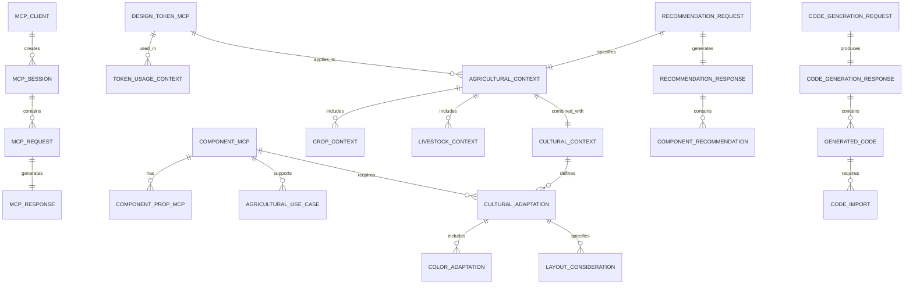

# Data Model: Fataplus MCP

**Feature Branch**: `003-fataplus-mcp`  
**Created**: 2025-01-09  
**Status**: Draft  

---

## Overview

This document defines the comprehensive data structures and interfaces for Fataplus MCP (Model Context Protocol) that enables AI tools to interact intelligently with the entire Fataplus Agritech Platform. The data model encompasses MCP protocol structures, platform architecture metadata, service integrations, agricultural context intelligence, cultural adaptation data, and complete development workflow patterns.

## Platform Architecture Data Models

### Service Architecture Models

#### Platform Service Registry
```typescript
interface PlatformService {
  id: string;
  name: string;
  type: ServiceType;
  version: string;
  description: string;
  
  // Service configuration
  endpoints: ServiceEndpoint[];
  port: number;
  baseUrl: string;
  healthCheck: HealthCheckConfig;
  
  // Platform integration
  dependencies: ServiceDependency[];
  integrations: ServiceIntegration[];
  authentication: AuthenticationConfig;
  
  // Agricultural context
  agriculturalCapabilities: AgriculturalCapability[];
  supportedContexts: AgriculturalContext[];
  
  // Deployment information
  deployment: DeploymentConfig;
  monitoring: MonitoringConfig;
  scaling: ScalingConfig;
}

type ServiceType = 
  | 'frontend'      // Next.js web application
  | 'backend'       // FastAPI backend services
  | 'ai-service'    // AI/ML microservices
  | 'mobile'        // React Native application
  | 'database'      // PostgreSQL/Redis services
  | 'infrastructure' // Supporting services
  | 'gateway';      // API gateway/proxy

interface ServiceEndpoint {
  path: string;
  method: HTTPMethod;
  description: string;
  requestSchema?: JSONSchema;
  responseSchema?: JSONSchema;
  authentication: AuthRequirement;
  rateLimit?: RateLimitConfig;
  agriculturalContext?: AgriculturalContextRelevance;
}
```

#### Database Architecture Models
```typescript
interface DatabaseSchema {
  id: string;
  name: string;
  type: 'postgresql' | 'redis' | 'spatial';
  version: string;
  
  // Schema definition
  tables: TableSchema[];
  relationships: TableRelationship[];
  indexes: IndexDefinition[];
  migrations: MigrationHistory[];
  
  // Agricultural data models
  agriculturalEntities: AgriculturalEntity[];
  spatialData: SpatialDataConfig[];
  
  // Performance and optimization
  partitioning: PartitioningStrategy[];
  caching: CachingStrategy[];
  backup: BackupConfig;
}

interface TableSchema {
  name: string;
  description: string;
  columns: ColumnDefinition[];
  constraints: TableConstraint[];
  triggers: TriggerDefinition[];
  
  // Agricultural context
  agriculturalPurpose?: string;
  dataClassification: DataClassification;
  regionSpecific: boolean;
  
  // PostGIS spatial extensions
  spatialColumns?: SpatialColumnDefinition[];
  spatialIndexes?: SpatialIndexDefinition[];
}

interface AgriculturalEntity {
  tableName: string;
  entityType: 'farm' | 'crop' | 'livestock' | 'equipment' | 'weather' | 'market';
  relationships: EntityRelationship[];
  businessRules: BusinessRule[];
  validationRules: ValidationRule[];
}
```

## MCP Protocol Data Models

### Core MCP Protocol Types

#### MCP Message Structure
```typescript
interface MCPMessage {
  jsonrpc: '2.0';
  method?: string;
  params?: any;
  result?: any;
  error?: MCPError;
  id: string | number | null;
}

interface MCPError {
  code: number;
  message: string;
  data?: any;
}

interface MCPRequest extends MCPMessage {
  method: string;
  params?: any;
}

interface MCPResponse extends MCPMessage {
  result?: any;
  error?: MCPError;
}

interface MCPNotification extends MCPMessage {
  method: string;
  params?: any;
}
```

#### Fataplus MCP Method Types
```typescript
type FataplusMCPMethod = 
  // Core design system methods
  | 'design-system/get-components'
  | 'design-system/get-tokens'
  | 'design-system/get-patterns'
  | 'design-system/recommend-components'
  | 'design-system/validate-usage'
  
  // Agricultural intelligence methods
  | 'agricultural/analyze-context'
  | 'agricultural/get-crops'
  | 'agricultural/get-livestock'
  | 'agricultural/get-practices'
  
  // Cultural adaptation methods
  | 'cultural/get-adaptations'
  | 'cultural/get-guidelines'
  | 'cultural/validate-cultural-appropriateness'
  
  // Documentation and examples
  | 'documentation/generate-examples'
  | 'documentation/get-guidelines'
  | 'documentation/generate-accessibility-guide'
  
  // Code generation and assistance
  | 'code/generate-component'
  | 'code/generate-imports'
  | 'code/validate-implementation';

interface FataplusMCPParams {
  // Context information
  context?: AgriculturalContext;
  cultural?: CulturalContext;
  accessibility?: AccessibilityRequirements;
  
  // Query parameters
  query?: string;
  filters?: QueryFilters;
  options?: QueryOptions;
}
```

### Authentication and Session Management

#### Authentication Models
```typescript
interface MCPAuthRequest {
  method: 'auth/authenticate';
  params: {
    apiKey?: string;
    token?: string;
    clientInfo: MCPClientInfo;
  };
}

interface MCPClientInfo {
  name: string;           // \"VS Code Extension\", \"Cursor AI\"
  version: string;        // \"1.0.0\"
  type: ClientType;       // \"ide\", \"ai_assistant\", \"ci_cd\"
  capabilities: string[]; // [\"code_generation\", \"documentation\"]
  user?: UserInfo;
}

type ClientType = 
  | 'ide'              // VS Code, WebStorm, etc.
  | 'ai_assistant'     // Claude, GPT, Copilot
  | 'design_tool'      // Figma, Sketch
  | 'ci_cd'            // GitHub Actions, Jenkins
  | 'documentation'    // Storybook, Docusaurus
  | 'testing';         // Jest, Playwright

interface UserInfo {
  id: string;
  role: UserRole;
  permissions: Permission[];
  preferences?: UserPreferences;
}

type UserRole = 'developer' | 'designer' | 'agricultural_expert' | 'admin';

interface Permission {
  resource: string;    // \"design-system\", \"agricultural-data\"
  actions: string[];   // [\"read\", \"write\", \"recommend\"]
}
```

## Design System Data Models

### Enhanced Design Token Model
```typescript
interface DesignTokenMCP {
  id: string;
  name: string;
  value: TokenValue;
  category: TokenCategory;
  description: string;
  
  // MCP-specific metadata
  mcp: {
    searchTags: string[];           // [\"green\", \"agriculture\", \"primary\"]
    usageContext: UsageContext[];   // Where this token is typically used
    alternatives: string[];         // Alternative token IDs
    deprecation?: DeprecationInfo;
  };
  
  // Agricultural context
  agricultural: {
    seasons: Season[];              // When this token is most relevant
    crops: string[];                // Associated crop types
    livestock: string[];            // Associated livestock
    contexts: AgriculturalUseCase[]; // Specific use cases
    culturalMeaning?: Record<AfricanRegion, string>;
  };
  
  // Accessibility information
  accessibility: {
    wcagCompliance: WCAGLevel;
    contrastRatio?: number;
    colorBlindSafe: boolean;
    recommendations: AccessibilityRecommendation[];
  };
  
  // Technical metadata
  technical: {
    cssProperty: string;            // \"--color-primary-500\"
    jsExport: string;              // \"tokens.colors.primary[500]\"
    platforms: Platform[];         // [\"web\", \"mobile\"]
    dependencies: string[];        // Other token IDs this depends on
  };
}

type TokenValue = string | number | TokenValueObject;

interface TokenValueObject {
  raw: string | number;
  computed?: string | number;
  scale?: Record<string, string | number>; // For responsive/scale tokens
}

type TokenCategory = 
  | 'color' | 'spacing' | 'typography' | 'shadow' | 'border'
  | 'animation' | 'agricultural' | 'cultural' | 'accessibility';
```

### Enhanced Component Model
```typescript
interface ComponentMCP {
  id: string;
  name: string;
  displayName: string;
  category: ComponentCategory;
  description: string;
  
  // MCP-specific metadata
  mcp: {
    searchTags: string[];           // [\"form\", \"input\", \"crop\", \"data-entry\"]
    complexity: ComplexityLevel;    // \"simple\", \"moderate\", \"complex\"
    popularity: number;             // Usage frequency score 0-1
    lastUpdated: Date;
    version: string;
  };
  
  // Component API
  api: {
    props: ComponentPropMCP[];
    variants: ComponentVariant[];
    states: ComponentState[];
    slots?: ComponentSlot[];        // For compound components
    events?: ComponentEvent[];
  };
  
  // Agricultural context
  agricultural: {
    useCases: AgriculturalUseCase[];
    relatedCrops: string[];
    relatedLivestock: string[];
    seasonalRelevance: SeasonalRelevance[];
    farmingPractices: string[];
    userTypes: AgriculturalUserType[];
  };
  
  // Cultural adaptations
  cultural: {
    adaptations: CulturalAdaptation[];
    restrictions: CulturalRestriction[];
    recommendations: CulturalRecommendation[];
  };
  
  // Accessibility features
  accessibility: {
    level: WCAGLevel;
    features: AccessibilityFeature[];
    testing: AccessibilityTest[];
    recommendations: AccessibilityRecommendation[];
  };
  
  // Code generation metadata
  code: {
    imports: CodeImport[];
    examples: CodeExample[];
    templates: CodeTemplate[];
    dependencies: string[];         // Other component IDs
  };
  
  // Documentation
  documentation: {
    overview: string;
    usage: UsageGuideline[];
    examples: DocumentationExample[];
    bestPractices: string[];
    antiPatterns: string[];
  };
}

interface ComponentPropMCP {
  name: string;
  type: PropType;
  required: boolean;
  default?: any;
  description: string;
  
  // MCP enhancements
  agricultural?: {
    contextRelevance: AgriculturalContext[];
    examples: Record<string, any>;  // Prop value examples by context
  };
  cultural?: {
    adaptations: Record<AfricanRegion, any>;
    restrictions: string[];         // Cultural restrictions
  };
  accessibility?: {
    ariaEquivalent?: string;
    screenReaderDescription?: string;
    keyboardBehavior?: string;
  };
}

type ComplexityLevel = 'simple' | 'moderate' | 'complex' | 'advanced';
type ComponentCategory = 
  | 'core' | 'layout' | 'navigation' | 'form' | 'display'
  | 'feedback' | 'agricultural' | 'cultural' | 'pattern';
```

## Agricultural Intelligence Models

### Agricultural Context Analysis
```typescript
interface AgriculturalContext {
  // Primary context
  useCase: string;                    // \"livestock health monitoring\"
  domain: AgriculturalDomain;         // \"crops\", \"livestock\", \"mixed\"
  
  // Geographic context
  region?: AfricanRegion;
  country?: string;
  climate?: ClimateZone;
  
  // Temporal context
  season?: Season;
  timeOfYear?: string;                // \"early-planting\", \"harvest-time\"
  
  // Agricultural specifics
  crops?: CropContext[];
  livestock?: LivestockContext[];
  farmingPractice?: FarmingPractice;
  
  // User context
  userType: AgriculturalUserType;
  experienceLevel: ExperienceLevel;
  literacyLevel: DigitalLiteracyLevel;
  
  // Technical context
  devices?: DeviceType[];
  connectivity?: ConnectivityLevel;
  languages?: LanguageCode[];
}

interface CropContext {
  id: string;
  name: string;
  scientificName?: string;
  variety?: string;
  stage: CropStage;                   // \"planting\", \"growing\", \"harvest\"
  challenges?: string[];              // [\"pest-management\", \"irrigation\"]
  culturalSignificance?: string;
}

interface LivestockContext {
  id: string;
  species: string;
  breed?: string;
  purpose: LivestockPurpose;          // \"dairy\", \"meat\", \"breeding\"
  healthConcerns?: string[];
  managementSystem?: string;          // \"intensive\", \"extensive\", \"mixed\"
}

type AgriculturalDomain = 'crops' | 'livestock' | 'aquaculture' | 'agroforestry' | 'mixed';
type FarmingPractice = 'traditional' | 'organic' | 'conventional' | 'precision' | 'sustainable';
type ExperienceLevel = 'beginner' | 'intermediate' | 'experienced' | 'expert';
type DigitalLiteracyLevel = 'low' | 'moderate' | 'high';
type ConnectivityLevel = 'offline' | 'limited' | 'good' | 'excellent';
```

### Agricultural Knowledge Base
```typescript
interface CropData {
  id: string;
  name: string;
  scientificName: string;
  commonNames: Record<LanguageCode, string[]>;
  
  // Geographic and climate data
  regions: AfricanRegion[];
  countries: string[];
  climateZones: ClimateZone[];
  
  // Growing information
  seasons: {
    planting: SeasonalPeriod[];
    growing: SeasonalPeriod[];
    harvest: SeasonalPeriod[];
  };
  
  // UI component associations
  relevantComponents: ComponentRelevance[];
  specificUIPatterns: string[];
  dataVisualization: VisualizationType[];
  
  // Cultural and economic data
  culturalSignificance: Record<AfricanRegion, CulturalSignificance>;
  economicImportance: EconomicImportance;
  
  // Agricultural practices
  commonPractices: FarmingPractice[];
  challenges: string[];
  opportunities: string[];
}

interface LivestockData {
  id: string;
  species: string;
  breeds: BreedInfo[];
  
  // Management data
  managementSystems: ManagementSystem[];
  healthIndicators: HealthIndicator[];
  productionMetrics: ProductionMetric[];
  
  // UI component associations
  relevantComponents: ComponentRelevance[];
  dashboardPatterns: string[];
  monitoringTools: string[];
  
  // Regional data
  regionalAdaptations: Record<AfricanRegion, RegionalAdaptation>;
  culturalPractices: CulturalPractice[];
}

interface ComponentRelevance {
  componentId: string;
  relevanceScore: number;             // 0-1
  context: string[];                  // [\"data-entry\", \"monitoring\"]
  examples: string[];                 // Usage examples
}
```

## Cultural Adaptation Models

### Cultural Context and Guidelines
```typescript
interface CulturalContext {
  region: AfricanRegion;
  country?: string;
  language: LanguageCode;
  script: Script;
  
  // Cultural preferences
  colorMeanings: Record<string, ColorMeaning>;
  symbolism: CulturalSymbolism;
  communication: CommunicationStyle;
  
  // Agricultural culture
  agriculturalTraditions: AgriculturalTradition[];
  seasonalCelebrations: SeasonalCelebration[];
  farmingRituals: FarmingRitual[];
}

interface CulturalAdaptation {
  id: string;
  region: AfricanRegion;
  language: LanguageCode;
  
  // Visual adaptations
  colorAdaptations: ColorAdaptation[];
  iconAdaptations: IconAdaptation[];
  imageAdaptations: ImageAdaptation[];
  
  // Text and language adaptations
  textDirection: 'ltr' | 'rtl';
  fontRecommendations: FontRecommendation[];
  terminologyAdaptations: TerminologyAdaptation[];
  
  // Layout adaptations
  layoutConsiderations: LayoutConsideration[];
  spacingAdjustments: SpacingAdjustment[];
  
  // Agricultural cultural adaptations
  agriculturalImagery: AgriculturalImagery[];
  seasonalAdaptations: SeasonalAdaptation[];
  practiceRepresentations: PracticeRepresentation[];
}

interface ColorMeaning {
  color: string;
  positiveAssociations: string[];
  negativeAssociations: string[];
  agriculturalContext: string;
  recommendations: string[];
  restrictions: string[];
}

interface CulturalRestriction {
  type: 'color' | 'image' | 'symbol' | 'text' | 'gesture';
  description: string;
  severity: 'low' | 'medium' | 'high' | 'critical';
  alternatives: string[];
  explanation: string;
}
```

## AI Recommendation Models

### Recommendation Engine Data
```typescript
interface RecommendationRequest {
  context: AgriculturalContext;
  cultural?: CulturalContext;
  accessibility?: AccessibilityRequirements;
  constraints?: RecommendationConstraints;
  preferences?: UserPreferences;
}

interface RecommendationResponse {
  recommendations: ComponentRecommendation[];
  patterns: PatternRecommendation[];
  tokens: TokenRecommendation[];
  culturalNotes: CulturalNote[];
  accessibilityNotes: AccessibilityNote[];
  explanation: RecommendationExplanation;
}

interface ComponentRecommendation {
  component: ComponentMCP;
  relevanceScore: number;             // 0-1
  confidence: number;                 // 0-1
  reasoning: string[];
  
  // Context-specific configuration
  recommendedProps: Record<string, any>;
  agriculturalConfig: AgriculturalConfiguration;
  culturalAdaptations: CulturalAdaptation[];
  
  // Usage guidance
  usagePatterns: UsagePattern[];
  bestPractices: string[];
  warnings: string[];
  
  // Code generation
  codeExample: CodeExample;
  imports: CodeImport[];
  dependencies: string[];
}

interface PatternRecommendation {
  id: string;
  name: string;
  description: string;
  complexity: ComplexityLevel;
  
  // Pattern composition
  components: ComponentComposition[];
  layout: LayoutPattern;
  interactions: InteractionPattern[];
  
  // Agricultural context
  agriculturalWorkflow: WorkflowStep[];
  dataFlow: DataFlowPattern;
  
  // Implementation guidance
  implementationSteps: ImplementationStep[];
  codeTemplate: CodeTemplate;
  testing: TestingGuidance;
}

interface RecommendationConstraints {
  maxComplexity?: ComplexityLevel;
  requiredAccessibility?: WCAGLevel;
  culturalRestrictions?: CulturalRestriction[];
  technicalConstraints?: TechnicalConstraint[];
  performanceRequirements?: PerformanceRequirement[];
}
```

### Code Generation Models

```typescript
interface CodeGenerationRequest {
  components: string[];               // Component IDs to generate
  context: AgriculturalContext;
  cultural?: CulturalContext;
  framework: 'react' | 'vue' | 'angular' | 'svelte';
  language: 'typescript' | 'javascript';
  styling: 'tailwind' | 'css-modules' | 'styled-components';
}

interface CodeGenerationResponse {
  code: GeneratedCode[];
  imports: CodeImport[];
  dependencies: PackageDependency[];
  setup: SetupInstruction[];
  testing: TestCode[];
  documentation: GeneratedDocumentation;
}

interface GeneratedCode {
  filename: string;
  content: string;
  language: 'typescript' | 'javascript' | 'css' | 'json';
  type: 'component' | 'hook' | 'utility' | 'style' | 'config';
  
  // Context metadata
  agriculturalContext: string[];
  culturalAdaptations: string[];
  accessibilityFeatures: string[];
  
  // Quality information
  quality: {
    complexity: ComplexityLevel;
    maintainability: number;          // 0-1
    performance: number;              // 0-1
    accessibility: number;            // 0-1
  };
}

interface CodeTemplate {
  id: string;
  name: string;
  description: string;
  template: string;                   // Template with placeholders
  variables: TemplateVariable[];
  conditions: TemplateCondition[];
  
  // Context awareness
  agriculturalAdaptations: Record<string, string>;
  culturalVariations: Record<AfricanRegion, string>;
  accessibilityEnhancements: string[];
}
```

## Performance and Analytics Models

### Usage Analytics
```typescript
interface MCPUsageEvent {
  timestamp: Date;
  sessionId: string;
  clientInfo: MCPClientInfo;
  
  // Request information
  method: FataplusMCPMethod;
  params: any;
  responseTime: number;
  success: boolean;
  error?: MCPError;
  
  // Context information
  agriculturalContext?: AgriculturalContext;
  culturalContext?: CulturalContext;
  
  // Recommendation tracking
  recommendationsProvided?: number;
  recommendationsAccepted?: number;
  userFeedback?: UserFeedback;
}

interface RecommendationEffectiveness {
  componentId: string;
  context: AgriculturalContext;
  
  // Usage metrics
  timesRecommended: number;
  timesAccepted: number;
  userSatisfaction: number;           // 0-1
  
  // Performance metrics
  implementationSuccess: number;      // 0-1
  culturalAppropriateness: number;    // 0-1
  accessibilityCompliance: number;   // 0-1
  
  // Feedback
  positiveFeedback: string[];
  negativeFeedback: string[];
  improvementSuggestions: string[];
}

interface UserFeedback {
  rating: number;                     // 1-5
  helpful: boolean;
  culturallyAppropriate: boolean;
  accessibilityCompliant: boolean;
  comments?: string;
  suggestions?: string[];
}
```

### Performance Monitoring
```typescript
interface MCPServerMetrics {
  timestamp: Date;
  
  // Performance metrics
  responseTime: {
    average: number;
    p50: number;
    p90: number;
    p95: number;
    p99: number;
  };
  
  // Usage metrics
  requestsPerSecond: number;
  activeConnections: number;
  totalRequests: number;
  errorRate: number;
  
  // Resource usage
  memoryUsage: number;
  cpuUsage: number;
  cacheHitRate: number;
  
  // Method-specific metrics
  methodMetrics: Record<FataplusMCPMethod, MethodMetrics>;
}

interface MethodMetrics {
  requestCount: number;
  averageResponseTime: number;
  errorRate: number;
  cacheHitRate?: number;
  
  // Context-specific metrics
  agriculturalContextAccuracy?: number;
  culturalAppropriatenessScore?: number;
  recommendationQuality?: number;
}
```

## Data Relationships

### Entity Relationship Diagram


## Data Validation and Schema

### Schema Validation
```typescript
// Example Zod schemas for runtime validation
const AgriculturalContextSchema = z.object({
  useCase: z.string().min(1),
  domain: z.enum(['crops', 'livestock', 'aquaculture', 'agroforestry', 'mixed']),
  region: z.enum(['west_africa', 'east_africa', 'southern_africa', 'north_africa', 'central_africa']).optional(),
  season: z.enum(['planting', 'growing', 'harvest', 'dormant']).optional(),
  userType: z.enum(['farmer', 'cooperative_member', 'agricultural_business', 'extension_worker']),
  crops: z.array(CropContextSchema).optional(),
  livestock: z.array(LivestockContextSchema).optional()
});

const ComponentRecommendationSchema = z.object({
  component: ComponentMCPSchema,
  relevanceScore: z.number().min(0).max(1),
  confidence: z.number().min(0).max(1),
  reasoning: z.array(z.string()),
  recommendedProps: z.record(z.any()),
  codeExample: CodeExampleSchema
});
```

### Data Quality Rules
- **Recommendation Accuracy**: All agricultural context recommendations must be validated by domain experts
- **Cultural Sensitivity**: All cultural adaptations must be reviewed by regional cultural experts
- **Accessibility Compliance**: All accessibility recommendations must meet WCAG 2.1 AA standards
- **Performance Standards**: All MCP responses must complete within 500ms for standard queries
- **Data Consistency**: All design system data must remain synchronized with source components

---

*This comprehensive data model provides the structural foundation for building an intelligent MCP server that can understand agricultural contexts, provide culturally-appropriate recommendations, and generate accurate code examples for the Fataplus Design System.*