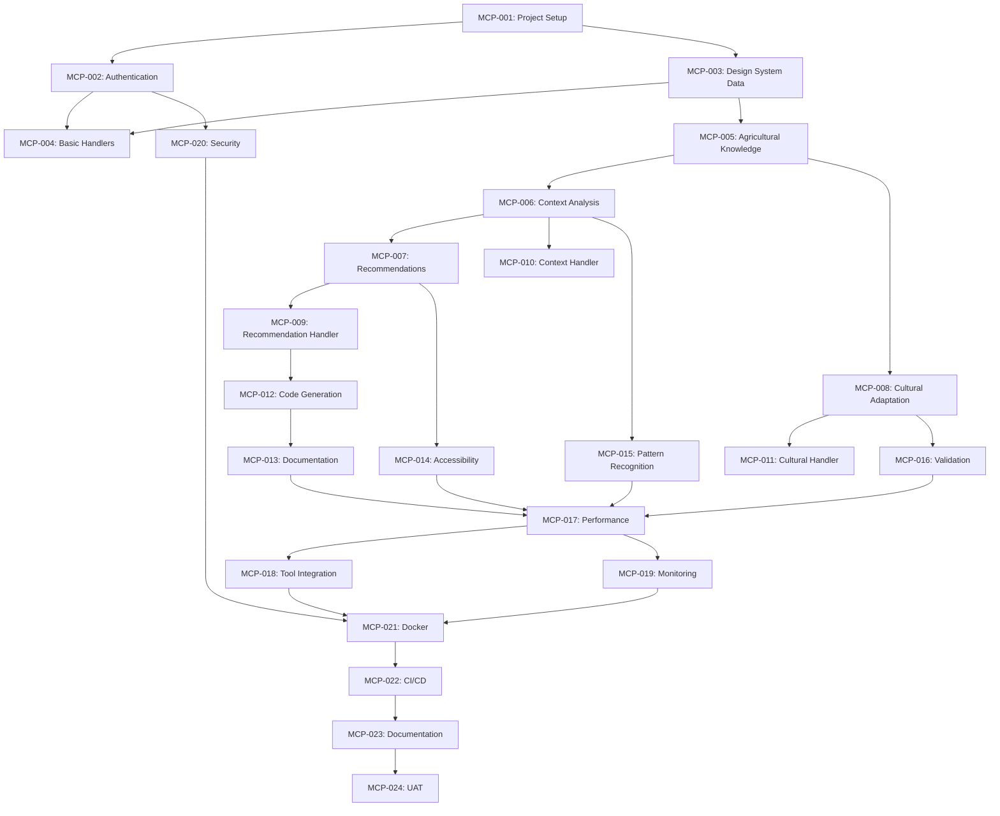

# Development Tasks: MCP Server for Fataplus Design System

**Feature Branch**: `003-mcp-server-for`  
**Created**: 2025-01-09  
**Status**: Draft  

---

## Task Breakdown Structure

### Phase 1: MCP Foundation (Weeks 1-4)

#### 1.1 Project Infrastructure
- **Task ID**: MCP-001
- **Title**: MCP Server Project Setup
- **Description**: Initialize TypeScript project with MCP protocol foundation
- **Acceptance Criteria**:
  - [ ] TypeScript project initialized with strict configuration
  - [ ] MCP protocol specification implemented
  - [ ] WebSocket and HTTP server setup
  - [ ] Request/response validation framework
  - [ ] Basic error handling and logging
- **Estimate**: 3 days
- **Dependencies**: None
- **Assignee**: Backend Developer

#### 1.2 Authentication Framework
- **Task ID**: MCP-002
- **Title**: MCP Authentication and Authorization
- **Description**: Implement secure authentication for MCP client connections
- **Acceptance Criteria**:
  - [ ] JWT token authentication system
  - [ ] API key support for tool integrations
  - [ ] Role-based access control for different client types
  - [ ] Rate limiting and request throttling
  - [ ] Security audit compliance
- **Estimate**: 2 days
- **Dependencies**: MCP-001
- **Assignee**: Backend Developer

#### 1.3 Design System Data Integration
- **Task ID**: MCP-003
- **Title**: Design System Data Access Layer
- **Description**: Build data access layer for existing Fataplus design tokens and components
- **Acceptance Criteria**:
  - [ ] Design token extraction from Tailwind config
  - [ ] Component metadata extraction from UI library
  - [ ] JSON schema validation for design system data
  - [ ] Caching layer for design system queries
  - [ ] Real-time data synchronization capability
- **Estimate**: 4 days
- **Dependencies**: MCP-001
- **Assignee**: Frontend Developer + Backend Developer

#### 1.4 Basic MCP Handlers
- **Task ID**: MCP-004
- **Title**: Core MCP Request Handlers
- **Description**: Implement basic MCP handlers for design system queries
- **Acceptance Criteria**:
  - [ ] `design-system/get-components` handler
  - [ ] `design-system/get-tokens` handler
  - [ ] Response formatting and validation
  - [ ] Error handling with proper MCP error codes
  - [ ] Basic request logging and monitoring
- **Estimate**: 3 days
- **Dependencies**: MCP-002, MCP-003
- **Assignee**: Backend Developer

### Phase 2: Agricultural Intelligence (Weeks 5-8)

#### 2.1 Agricultural Knowledge Base
- **Task ID**: MCP-005
- **Title**: Agricultural Data Foundation
- **Description**: Create comprehensive agricultural knowledge base for context analysis
- **Acceptance Criteria**:
  - [ ] Crop database with African varieties and seasons
  - [ ] Livestock management data for African contexts
  - [ ] Regional farming practices database
  - [ ] Cultural significance and usage patterns
  - [ ] JSON schema validation for agricultural data
- **Estimate**: 5 days
- **Dependencies**: MCP-003
- **Assignee**: Agricultural Domain Expert + Backend Developer

#### 2.2 Context Analysis Engine
- **Task ID**: MCP-006
- **Title**: Agricultural Context Understanding
- **Description**: Build AI-powered analysis of agricultural contexts from user queries
- **Acceptance Criteria**:
  - [ ] Natural language processing for agricultural terms
  - [ ] Context extraction with confidence scoring
  - [ ] Seasonal and regional context awareness
  - [ ] User type and use case identification
  - [ ] Context validation and fallback mechanisms
- **Estimate**: 6 days
- **Dependencies**: MCP-005
- **Assignee**: AI/ML Developer + Agricultural Domain Expert

#### 2.3 Component Recommendation System
- **Task ID**: MCP-007
- **Title**: Intelligent Component Recommendations
- **Description**: Create recommendation algorithms for agricultural contexts
- **Acceptance Criteria**:
  - [ ] Component relevance scoring algorithms
  - [ ] Agricultural use case pattern matching
  - [ ] Seasonal variation recommendations
  - [ ] User type-specific suggestions
  - [ ] Recommendation explanation generation
- **Estimate**: 5 days
- **Dependencies**: MCP-006
- **Assignee**: AI/ML Developer

#### 2.4 Cultural Adaptation Service
- **Task ID**: MCP-008
- **Title**: Cultural Intelligence Integration
- **Description**: Implement cultural adaptation recommendations for African regions
- **Acceptance Criteria**:
  - [ ] Regional cultural guidelines database
  - [ ] Language-specific adaptation rules
  - [ ] Cultural color and symbol meaning integration
  - [ ] Region-specific component variations
  - [ ] Cultural sensitivity validation
- **Estimate**: 4 days
- **Dependencies**: MCP-005
- **Assignee**: Cultural Consultant + Backend Developer

### Phase 3: Advanced MCP Handlers (Weeks 9-12)

#### 3.1 Recommendation Handler
- **Task ID**: MCP-009
- **Title**: Component Recommendation MCP Handler
- **Description**: Implement intelligent component recommendation MCP endpoint
- **Acceptance Criteria**:
  - [ ] `design-system/recommend-components` handler
  - [ ] Context analysis integration
  - [ ] Ranked recommendation responses
  - [ ] Explanation and reasoning in responses
  - [ ] Performance optimization for complex queries
- **Estimate**: 3 days
- **Dependencies**: MCP-007
- **Assignee**: Backend Developer

#### 3.2 Agricultural Context Handler
- **Task ID**: MCP-010
- **Title**: Agricultural Context Analysis Handler
- **Description**: Create dedicated handler for agricultural context analysis
- **Acceptance Criteria**:
  - [ ] `agricultural/analyze-context` handler
  - [ ] Detailed context breakdown responses
  - [ ] Confidence scoring and uncertainty handling
  - [ ] Seasonal and regional context enrichment
  - [ ] Agricultural workflow pattern detection
- **Estimate**: 4 days
- **Dependencies**: MCP-006
- **Assignee**: Backend Developer

#### 3.3 Cultural Adaptation Handler
- **Task ID**: MCP-011
- **Title**: Cultural Adaptation MCP Handler
- **Description**: Implement cultural adaptation guidance MCP endpoint
- **Acceptance Criteria**:
  - [ ] `cultural/get-adaptations` handler
  - [ ] Region-specific adaptation recommendations
  - [ ] Language and script direction guidance
  - [ ] Cultural sensitivity notes and warnings
  - [ ] Examples of successful adaptations
- **Estimate**: 3 days
- **Dependencies**: MCP-008
- **Assignee**: Backend Developer

#### 3.4 Code Generation Engine
- **Task ID**: MCP-012
- **Title**: AI-Powered Code Generation
- **Description**: Build intelligent code generation for recommended components
- **Acceptance Criteria**:
  - [ ] TypeScript/React code template engine
  - [ ] Component import resolution
  - [ ] Prop configuration generation
  - [ ] Agricultural context-specific examples
  - [ ] Code validation and syntax checking
- **Estimate**: 5 days
- **Dependencies**: MCP-009
- **Assignee**: Frontend Developer + AI/ML Developer

### Phase 4: Documentation and Accessibility (Weeks 13-16)

#### 4.1 Documentation Generation
- **Task ID**: MCP-013
- **Title**: Dynamic Documentation Generation
- **Description**: Create contextual documentation generation for agricultural scenarios
- **Acceptance Criteria**:
  - [ ] `documentation/generate-examples` handler
  - [ ] Agricultural scenario-specific documentation
  - [ ] Code examples with cultural adaptations
  - [ ] Accessibility guidelines integration
  - [ ] Multi-language documentation support
- **Estimate**: 4 days
- **Dependencies**: MCP-012
- **Assignee**: Technical Writer + Backend Developer

#### 4.2 Accessibility Intelligence
- **Task ID**: MCP-014
- **Title**: Automated Accessibility Analysis
- **Description**: Implement accessibility analysis and recommendations
- **Acceptance Criteria**:
  - [ ] WCAG compliance validation
  - [ ] Accessibility improvement suggestions
  - [ ] Rural environment accessibility considerations
  - [ ] Screen reader compatibility analysis
  - [ ] High contrast and visual accessibility recommendations
- **Estimate**: 4 days
- **Dependencies**: MCP-007
- **Assignee**: Accessibility Specialist + Backend Developer

#### 4.3 Pattern Recognition System
- **Task ID**: MCP-015
- **Title**: Agricultural UI Pattern Detection
- **Description**: Build pattern recognition for complex agricultural workflows
- **Acceptance Criteria**:
  - [ ] Agricultural workflow pattern library
  - [ ] Pattern matching algorithms
  - [ ] Complex UI pattern recommendations
  - [ ] Pattern composition and customization
  - [ ] Pattern performance and usability validation
- **Estimate**: 5 days
- **Dependencies**: MCP-006, MCP-007
- **Assignee**: AI/ML Developer + UX Designer

#### 4.4 Validation and Testing Framework
- **Task ID**: MCP-016
- **Title**: Design System Validation
- **Description**: Create validation framework for design system compliance
- **Acceptance Criteria**:
  - [ ] `design-system/validate-usage` handler
  - [ ] Component usage validation rules
  - [ ] Design token compliance checking
  - [ ] Agricultural context appropriateness validation
  - [ ] Cultural sensitivity compliance checking
- **Estimate**: 3 days
- **Dependencies**: MCP-008, MCP-014
- **Assignee**: Backend Developer + Quality Assurance

### Phase 5: Performance and Integration (Weeks 17-20)

#### 5.1 Performance Optimization
- **Task ID**: MCP-017
- **Title**: MCP Server Performance Optimization
- **Description**: Optimize server performance for high-volume AI tool queries
- **Acceptance Criteria**:
  - [ ] Redis caching implementation
  - [ ] Response time optimization (<500ms)
  - [ ] Connection pooling for concurrent requests
  - [ ] Memory usage optimization
  - [ ] Load testing and performance benchmarks
- **Estimate**: 4 days
- **Dependencies**: All previous MCP handlers
- **Assignee**: Backend Developer

#### 5.2 Tool Integration Framework
- **Task ID**: MCP-018
- **Title**: Development Tool Integration
- **Description**: Create integration framework for popular development tools
- **Acceptance Criteria**:
  - [ ] VS Code extension integration example
  - [ ] WebStorm/IntelliJ plugin framework
  - [ ] Cursor AI integration
  - [ ] Generic IDE integration SDK
  - [ ] Integration testing with real tools
- **Estimate**: 6 days
- **Dependencies**: MCP-017
- **Assignee**: Frontend Developer + DevOps Engineer

#### 5.3 Monitoring and Analytics
- **Task ID**: MCP-019
- **Title**: MCP Server Monitoring and Analytics
- **Description**: Implement comprehensive monitoring and usage analytics
- **Acceptance Criteria**:
  - [ ] Request/response logging with structured data
  - [ ] Performance metrics collection
  - [ ] Usage analytics and recommendation effectiveness
  - [ ] Error tracking and alerting
  - [ ] Health check endpoints
- **Estimate**: 3 days
- **Dependencies**: MCP-017
- **Assignee**: Backend Developer + DevOps Engineer

#### 5.4 Security Hardening
- **Task ID**: MCP-020
- **Title**: Production Security Implementation
- **Description**: Implement production-grade security measures
- **Acceptance Criteria**:
  - [ ] Input validation and sanitization
  - [ ] Rate limiting and DDoS protection
  - [ ] Secure credential management
  - [ ] Audit logging for security events
  - [ ] Security penetration testing
- **Estimate**: 3 days
- **Dependencies**: MCP-002
- **Assignee**: Security Engineer + Backend Developer

### Phase 6: Production Deployment (Weeks 21-24)

#### 6.1 Docker Integration
- **Task ID**: MCP-021
- **Title**: Containerization and Deployment
- **Description**: Create Docker integration for MCP server deployment
- **Acceptance Criteria**:
  - [ ] Multi-stage Dockerfile for MCP server
  - [ ] Docker Compose integration with Fataplus platform
  - [ ] Health checks and service monitoring
  - [ ] Environment configuration management
  - [ ] Production deployment scripts
- **Estimate**: 2 days
- **Dependencies**: MCP-020
- **Assignee**: DevOps Engineer

#### 6.2 CI/CD Pipeline
- **Task ID**: MCP-022
- **Title**: Continuous Integration and Deployment
- **Description**: Set up automated testing and deployment pipeline
- **Acceptance Criteria**:
  - [ ] Automated testing on pull requests
  - [ ] Code quality and security scanning
  - [ ] Automated deployment to staging/production
  - [ ] Rollback mechanisms and blue-green deployment
  - [ ] Integration with existing Fataplus CI/CD
- **Estimate**: 3 days
- **Dependencies**: MCP-021
- **Assignee**: DevOps Engineer

#### 6.3 API Documentation
- **Task ID**: MCP-023
- **Title**: Comprehensive API Documentation
- **Description**: Create complete documentation for MCP server API
- **Acceptance Criteria**:
  - [ ] OpenAPI/Swagger specification
  - [ ] Interactive API documentation
  - [ ] Integration guides for different tools
  - [ ] Agricultural context examples
  - [ ] Troubleshooting and FAQ documentation
- **Estimate**: 4 days
- **Dependencies**: All MCP handlers
- **Assignee**: Technical Writer + Backend Developer

#### 6.4 User Acceptance Testing
- **Task ID**: MCP-024
- **Title**: End-to-End Testing and Validation
- **Description**: Conduct comprehensive testing with real agricultural scenarios
- **Acceptance Criteria**:
  - [ ] Testing with Fataplus development team
  - [ ] Agricultural expert validation of recommendations
  - [ ] Cultural expert review of adaptations
  - [ ] Performance testing under production load
  - [ ] Integration testing with actual AI tools
- **Estimate**: 5 days
- **Dependencies**: MCP-022, MCP-023
- **Assignee**: Quality Assurance + Agricultural Domain Expert

## Task Dependencies

## Resource Allocation

### Team Composition
- **Backend Developer**: 100% allocation (MCP protocol, handlers, performance)
- **AI/ML Developer**: 75% allocation (context analysis, recommendations, patterns)
- **Frontend Developer**: 50% allocation (code generation, tool integration)
- **Agricultural Domain Expert**: 25% allocation (knowledge base, validation)
- **Cultural Consultant**: 15% allocation (cultural adaptation, validation)
- **DevOps Engineer**: 25% allocation (deployment, monitoring, CI/CD)
- **Quality Assurance**: 25% allocation (testing, validation, security)
- **Technical Writer**: 25% allocation (documentation, examples)

### Week-by-Week Allocation

#### Weeks 1-4: Foundation
- **Backend Developer**: 100% (protocol implementation, data integration)
- **Frontend Developer**: 25% (design system data extraction)
- **Agricultural Domain Expert**: 50% (knowledge base planning)

#### Weeks 5-8: Intelligence
- **Backend Developer**: 75% (data services, cultural integration)
- **AI/ML Developer**: 100% (context analysis, recommendations)
- **Agricultural Domain Expert**: 100% (knowledge base development)
- **Cultural Consultant**: 100% (cultural guidelines)

#### Weeks 9-12: Advanced Features
- **Backend Developer**: 100% (advanced handlers, code generation)
- **AI/ML Developer**: 100% (pattern recognition, optimization)
- **Frontend Developer**: 75% (code generation, examples)

#### Weeks 13-16: Documentation & Accessibility
- **Backend Developer**: 75% (validation, accessibility integration)
- **Technical Writer**: 100% (documentation generation)
- **Accessibility Specialist**: 100% (accessibility analysis)
- **Quality Assurance**: 50% (testing framework)

#### Weeks 17-20: Performance & Integration
- **Backend Developer**: 100% (performance optimization)
- **Frontend Developer**: 100% (tool integration)
- **DevOps Engineer**: 100% (monitoring, security)
- **Quality Assurance**: 75% (performance testing)

#### Weeks 21-24: Production
- **DevOps Engineer**: 100% (deployment, CI/CD)
- **Quality Assurance**: 100% (end-to-end testing)
- **Technical Writer**: 100% (final documentation)
- **Agricultural Domain Expert**: 50% (final validation)

## Success Metrics

### Development Metrics
- **Task Completion**: 100% of identified tasks completed on schedule
- **Code Coverage**: >90% unit test coverage
- **Performance**: <500ms response time for 95% of queries
- **Reliability**: 99.9% uptime for MCP server

### Quality Metrics
- **Agricultural Accuracy**: 95% accuracy in agricultural context identification
- **Cultural Appropriateness**: 100% cultural recommendations reviewed by experts
- **Accessibility Compliance**: 100% WCAG 2.1 AA compliance
- **Integration Success**: Working integrations with 3+ development tools

### User Experience Metrics
- **Developer Satisfaction**: >8/10 in usability surveys
- **AI Tool Integration**: Successful integration with 5+ AI assistants
- **Recommendation Quality**: 90% of recommendations rated as helpful
- **Documentation Quality**: 95% of integration questions answered by documentation

---

*This comprehensive task breakdown provides a detailed roadmap for implementing the MCP server, ensuring high-quality delivery of intelligent design system access for AI tools and development environments.*