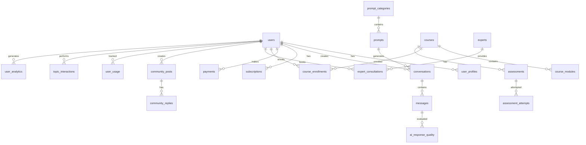

# Data Model: AgriBot.space

**Feature Branch**: `006-agribot-space`  
**Created**: 2025-09-09  
**Database**: PostgreSQL (Managed by Fataplus Platform via Cloudron)  

---

## Core Entities

### User Management

#### users
```sql
CREATE TABLE users (
  id UUID PRIMARY KEY DEFAULT gen_random_uuid(),
  keycloak_user_id VARCHAR(255) UNIQUE NOT NULL, -- Keycloak user ID
  email VARCHAR(255) UNIQUE NOT NULL,
  phone VARCHAR(50),
  full_name VARCHAR(255),
  avatar_url TEXT,
  tier VARCHAR(20) DEFAULT 'viewer' CHECK (tier IN ('viewer', 'registered', 'premium')),
  language VARCHAR(10) DEFAULT 'en',
  region VARCHAR(50),
  timezone VARCHAR(50),
  fataplus_user_id UUID, -- Link to Fataplus platform
  created_at TIMESTAMP WITH TIME ZONE DEFAULT NOW(),
  updated_at TIMESTAMP WITH TIME ZONE DEFAULT NOW(),
  last_login_at TIMESTAMP WITH TIME ZONE,
  is_active BOOLEAN DEFAULT true
);

CREATE INDEX idx_users_email ON users(email);
CREATE INDEX idx_users_keycloak_id ON users(keycloak_user_id);
CREATE INDEX idx_users_tier ON users(tier);
CREATE INDEX idx_users_region ON users(region);
```

#### user_profiles
```sql
CREATE TABLE user_profiles (
  id UUID PRIMARY KEY DEFAULT gen_random_uuid(),
  user_id UUID NOT NULL REFERENCES users(id) ON DELETE CASCADE,
  farm_type VARCHAR(100), -- crop, livestock, mixed, agribusiness
  farm_size_hectares DECIMAL(10,2),
  primary_crops TEXT[], -- Array of crop types
  livestock_types TEXT[], -- Array of livestock types
  experience_level VARCHAR(20) CHECK (experience_level IN ('beginner', 'intermediate', 'advanced')),
  interests TEXT[], -- Areas of interest
  goals TEXT[], -- Agricultural goals
  challenges TEXT[], -- Current challenges
  location_coordinates POINT, -- GPS coordinates
  location_address TEXT,
  created_at TIMESTAMP WITH TIME ZONE DEFAULT NOW(),
  updated_at TIMESTAMP WITH TIME ZONE DEFAULT NOW()
);

CREATE INDEX idx_user_profiles_user_id ON user_profiles(user_id);
CREATE INDEX idx_user_profiles_farm_type ON user_profiles(farm_type);
CREATE INDEX idx_user_profiles_location ON user_profiles USING GIST(location_coordinates);
```

### Content Management

#### prompt_categories
```sql
CREATE TABLE prompt_categories (
  id UUID PRIMARY KEY DEFAULT gen_random_uuid(),
  name VARCHAR(255) NOT NULL,
  description TEXT,
  icon VARCHAR(100),
  parent_id UUID REFERENCES prompt_categories(id),
  sort_order INTEGER DEFAULT 0,
  is_active BOOLEAN DEFAULT true,
  created_at TIMESTAMP WITH TIME ZONE DEFAULT NOW()
);

CREATE INDEX idx_prompt_categories_parent ON prompt_categories(parent_id);
CREATE INDEX idx_prompt_categories_active ON prompt_categories(is_active);
```

#### prompts
```sql
CREATE TABLE prompts (
  id UUID PRIMARY KEY DEFAULT gen_random_uuid(),
  title VARCHAR(255) NOT NULL,
  description TEXT,
  category_id UUID NOT NULL REFERENCES prompt_categories(id),
  system_prompt TEXT NOT NULL,
  user_prompt_template TEXT NOT NULL,
  expected_output_format VARCHAR(50) DEFAULT 'text',
  difficulty_level VARCHAR(20) CHECK (difficulty_level IN ('beginner', 'intermediate', 'advanced')),
  access_level VARCHAR(20) DEFAULT 'free' CHECK (access_level IN ('free', 'registered', 'premium')),
  estimated_tokens INTEGER DEFAULT 1000,
  cost_usd DECIMAL(8,4) DEFAULT 0.00,
  tags TEXT[],
  context_requirements TEXT[], -- Required Fataplus contexts
  popularity_score INTEGER DEFAULT 0,
  success_rate DECIMAL(5,2) DEFAULT 0.00, -- User satisfaction rate
  is_featured BOOLEAN DEFAULT false,
  is_active BOOLEAN DEFAULT true,
  created_by UUID REFERENCES users(id),
  created_at TIMESTAMP WITH TIME ZONE DEFAULT NOW(),
  updated_at TIMESTAMP WITH TIME ZONE DEFAULT NOW()
);

CREATE INDEX idx_prompts_category ON prompts(category_id);
CREATE INDEX idx_prompts_difficulty ON prompts(difficulty_level);
CREATE INDEX idx_prompts_access_level ON prompts(access_level);
CREATE INDEX idx_prompts_tags ON prompts USING GIN(tags);
CREATE INDEX idx_prompts_popularity ON prompts(popularity_score DESC);
```

### Conversation Management

#### conversations
```sql
CREATE TABLE conversations (
  id UUID PRIMARY KEY DEFAULT gen_random_uuid(),
  user_id UUID REFERENCES users(id) ON DELETE SET NULL,
  session_id VARCHAR(255), -- For guest users
  prompt_id UUID REFERENCES prompts(id),
  topic_title VARCHAR(255),
  status VARCHAR(20) DEFAULT 'active' CHECK (status IN ('active', 'completed', 'archived')),
  total_messages INTEGER DEFAULT 0,
  total_tokens_used INTEGER DEFAULT 0,
  cost_usd DECIMAL(8,4) DEFAULT 0.00,
  satisfaction_rating INTEGER CHECK (satisfaction_rating BETWEEN 1 AND 5),
  feedback_text TEXT,
  is_bookmarked BOOLEAN DEFAULT false,
  tags TEXT[],
  created_at TIMESTAMP WITH TIME ZONE DEFAULT NOW(),
  updated_at TIMESTAMP WITH TIME ZONE DEFAULT NOW(),
  completed_at TIMESTAMP WITH TIME ZONE
);

CREATE INDEX idx_conversations_user_id ON conversations(user_id);
CREATE INDEX idx_conversations_session_id ON conversations(session_id);
CREATE INDEX idx_conversations_status ON conversations(status);
CREATE INDEX idx_conversations_created_at ON conversations(created_at DESC);
```

#### messages
```sql
CREATE TABLE messages (
  id UUID PRIMARY KEY DEFAULT gen_random_uuid(),
  conversation_id UUID NOT NULL REFERENCES conversations(id) ON DELETE CASCADE,
  role VARCHAR(20) NOT NULL CHECK (role IN ('user', 'assistant', 'system')),
  content TEXT NOT NULL,
  metadata JSONB, -- Additional data like context used, model version, etc.
  tokens_used INTEGER DEFAULT 0,
  processing_time_ms INTEGER,
  context_data JSONB, -- Fataplus context data used for response
  is_flagged BOOLEAN DEFAULT false,
  flag_reason TEXT,
  created_at TIMESTAMP WITH TIME ZONE DEFAULT NOW()
);

CREATE INDEX idx_messages_conversation_id ON messages(conversation_id);
CREATE INDEX idx_messages_role ON messages(role);
CREATE INDEX idx_messages_created_at ON messages(created_at);
CREATE INDEX idx_messages_flagged ON messages(is_flagged);
```

### Usage Tracking

#### user_usage
```sql
CREATE TABLE user_usage (
  id UUID PRIMARY KEY DEFAULT gen_random_uuid(),
  user_id UUID NOT NULL REFERENCES users(id) ON DELETE CASCADE,
  session_id VARCHAR(255), -- For guest tracking
  month_year DATE NOT NULL, -- First day of the month
  topics_used INTEGER DEFAULT 0,
  messages_sent INTEGER DEFAULT 0,
  tokens_consumed INTEGER DEFAULT 0,
  total_cost_usd DECIMAL(10,4) DEFAULT 0.00,
  created_at TIMESTAMP WITH TIME ZONE DEFAULT NOW(),
  updated_at TIMESTAMP WITH TIME ZONE DEFAULT NOW(),
  
  UNIQUE(user_id, month_year)
);

CREATE INDEX idx_user_usage_user_month ON user_usage(user_id, month_year);
CREATE INDEX idx_user_usage_month_year ON user_usage(month_year);
```

#### topic_interactions
```sql
CREATE TABLE topic_interactions (
  id UUID PRIMARY KEY DEFAULT gen_random_uuid(),
  user_id UUID REFERENCES users(id) ON DELETE SET NULL,
  session_id VARCHAR(255),
  prompt_id UUID REFERENCES prompts(id),
  topic_name VARCHAR(255) NOT NULL,
  interaction_type VARCHAR(50) NOT NULL, -- 'started', 'completed', 'abandoned'
  duration_minutes INTEGER,
  satisfaction_rating INTEGER CHECK (satisfaction_rating BETWEEN 1 AND 5),
  converted_to_paid BOOLEAN DEFAULT false,
  created_at TIMESTAMP WITH TIME ZONE DEFAULT NOW()
);

CREATE INDEX idx_topic_interactions_user_id ON topic_interactions(user_id);
CREATE INDEX idx_topic_interactions_prompt_id ON topic_interactions(prompt_id);
CREATE INDEX idx_topic_interactions_type ON topic_interactions(interaction_type);
```

### Billing & Payments

#### subscriptions
```sql
CREATE TABLE subscriptions (
  id UUID PRIMARY KEY DEFAULT gen_random_uuid(),
  user_id UUID NOT NULL REFERENCES users(id) ON DELETE CASCADE,
  stripe_subscription_id VARCHAR(255) UNIQUE,
  plan_name VARCHAR(100) NOT NULL,
  status VARCHAR(50) NOT NULL CHECK (status IN ('active', 'canceled', 'past_due', 'unpaid')),
  current_period_start TIMESTAMP WITH TIME ZONE NOT NULL,
  current_period_end TIMESTAMP WITH TIME ZONE NOT NULL,
  cancel_at_period_end BOOLEAN DEFAULT false,
  amount_usd DECIMAL(8,2) NOT NULL,
  currency VARCHAR(3) DEFAULT 'USD',
  interval_type VARCHAR(20) CHECK (interval_type IN ('month', 'year')),
  trial_end TIMESTAMP WITH TIME ZONE,
  created_at TIMESTAMP WITH TIME ZONE DEFAULT NOW(),
  updated_at TIMESTAMP WITH TIME ZONE DEFAULT NOW()
);

CREATE INDEX idx_subscriptions_user_id ON subscriptions(user_id);
CREATE INDEX idx_subscriptions_status ON subscriptions(status);
CREATE INDEX idx_subscriptions_stripe_id ON subscriptions(stripe_subscription_id);
```

#### payments
```sql
CREATE TABLE payments (
  id UUID PRIMARY KEY DEFAULT gen_random_uuid(),
  user_id UUID NOT NULL REFERENCES users(id) ON DELETE CASCADE,
  stripe_payment_intent_id VARCHAR(255) UNIQUE,
  amount_usd DECIMAL(8,2) NOT NULL,
  currency VARCHAR(3) DEFAULT 'USD',
  status VARCHAR(50) NOT NULL,
  payment_method VARCHAR(100), -- stripe, mpesa, airtel_money, etc.
  description TEXT,
  metadata JSONB,
  created_at TIMESTAMP WITH TIME ZONE DEFAULT NOW(),
  paid_at TIMESTAMP WITH TIME ZONE
);

CREATE INDEX idx_payments_user_id ON payments(user_id);
CREATE INDEX idx_payments_status ON payments(status);
CREATE INDEX idx_payments_created_at ON payments(created_at);
```

#### topic_purchases
```sql
CREATE TABLE topic_purchases (
  id UUID PRIMARY KEY DEFAULT gen_random_uuid(),
  user_id UUID NOT NULL REFERENCES users(id) ON DELETE CASCADE,
  payment_id UUID REFERENCES payments(id),
  quantity INTEGER NOT NULL,
  unit_price_usd DECIMAL(8,4) NOT NULL,
  total_amount_usd DECIMAL(8,2) NOT NULL,
  expires_at TIMESTAMP WITH TIME ZONE, -- Topics expire monthly
  created_at TIMESTAMP WITH TIME ZONE DEFAULT NOW()
);

CREATE INDEX idx_topic_purchases_user_id ON topic_purchases(user_id);
CREATE INDEX idx_topic_purchases_payment_id ON topic_purchases(payment_id);
CREATE INDEX idx_topic_purchases_expires_at ON topic_purchases(expires_at);
```

### Educational Content

#### courses
```sql
CREATE TABLE courses (
  id UUID PRIMARY KEY DEFAULT gen_random_uuid(),
  title VARCHAR(255) NOT NULL,
  description TEXT,
  level VARCHAR(20) CHECK (level IN ('beginner', 'intermediate', 'advanced')),
  duration_hours INTEGER,
  price_usd DECIMAL(8,2) DEFAULT 0.00,
  access_level VARCHAR(20) DEFAULT 'premium' CHECK (access_level IN ('free', 'registered', 'premium')),
  category_id UUID REFERENCES prompt_categories(id),
  instructor_name VARCHAR(255),
  instructor_bio TEXT,
  cover_image_url TEXT,
  preview_video_url TEXT,
  prerequisites TEXT[],
  learning_objectives TEXT[],
  tags TEXT[],
  enrollment_count INTEGER DEFAULT 0,
  average_rating DECIMAL(3,2) DEFAULT 0.00,
  is_featured BOOLEAN DEFAULT false,
  is_published BOOLEAN DEFAULT false,
  created_by UUID REFERENCES users(id),
  created_at TIMESTAMP WITH TIME ZONE DEFAULT NOW(),
  updated_at TIMESTAMP WITH TIME ZONE DEFAULT NOW()
);

CREATE INDEX idx_courses_level ON courses(level);
CREATE INDEX idx_courses_category_id ON courses(category_id);
CREATE INDEX idx_courses_access_level ON courses(access_level);
CREATE INDEX idx_courses_published ON courses(is_published);
```

#### course_modules
```sql
CREATE TABLE course_modules (
  id UUID PRIMARY KEY DEFAULT gen_random_uuid(),
  course_id UUID NOT NULL REFERENCES courses(id) ON DELETE CASCADE,
  title VARCHAR(255) NOT NULL,
  description TEXT,
  content_text TEXT,
  video_url TEXT,
  duration_minutes INTEGER,
  sort_order INTEGER NOT NULL,
  ai_prompt_templates TEXT[], -- AI interaction prompts for this module
  practical_tasks TEXT[],
  is_published BOOLEAN DEFAULT false,
  created_at TIMESTAMP WITH TIME ZONE DEFAULT NOW()
);

CREATE INDEX idx_course_modules_course_id ON course_modules(course_id);
CREATE INDEX idx_course_modules_sort_order ON course_modules(course_id, sort_order);
```

#### course_enrollments
```sql
CREATE TABLE course_enrollments (
  id UUID PRIMARY KEY DEFAULT gen_random_uuid(),
  user_id UUID NOT NULL REFERENCES users(id) ON DELETE CASCADE,
  course_id UUID NOT NULL REFERENCES courses(id) ON DELETE CASCADE,
  status VARCHAR(20) DEFAULT 'active' CHECK (status IN ('active', 'completed', 'dropped')),
  progress_percentage INTEGER DEFAULT 0 CHECK (progress_percentage BETWEEN 0 AND 100),
  last_accessed_module_id UUID REFERENCES course_modules(id),
  completion_certificate_url TEXT,
  enrolled_at TIMESTAMP WITH TIME ZONE DEFAULT NOW(),
  completed_at TIMESTAMP WITH TIME ZONE,
  
  UNIQUE(user_id, course_id)
);

CREATE INDEX idx_course_enrollments_user_id ON course_enrollments(user_id);
CREATE INDEX idx_course_enrollments_course_id ON course_enrollments(course_id);
CREATE INDEX idx_course_enrollments_status ON course_enrollments(status);
```

#### assessments
```sql
CREATE TABLE assessments (
  id UUID PRIMARY KEY DEFAULT gen_random_uuid(),
  course_id UUID REFERENCES courses(id) ON DELETE CASCADE,
  module_id UUID REFERENCES course_modules(id) ON DELETE CASCADE,
  prompt_id UUID REFERENCES prompts(id), -- For standalone assessments
  title VARCHAR(255) NOT NULL,
  description TEXT,
  assessment_type VARCHAR(50) CHECK (assessment_type IN ('quiz', 'practical', 'ai_conversation', 'peer_review')),
  questions JSONB NOT NULL, -- Array of question objects
  passing_score INTEGER DEFAULT 70,
  time_limit_minutes INTEGER,
  max_attempts INTEGER DEFAULT 3,
  is_required BOOLEAN DEFAULT false,
  created_at TIMESTAMP WITH TIME ZONE DEFAULT NOW()
);

CREATE INDEX idx_assessments_course_id ON assessments(course_id);
CREATE INDEX idx_assessments_module_id ON assessments(module_id);
CREATE INDEX idx_assessments_type ON assessments(assessment_type);
```

#### assessment_attempts
```sql
CREATE TABLE assessment_attempts (
  id UUID PRIMARY KEY DEFAULT gen_random_uuid(),
  user_id UUID NOT NULL REFERENCES users(id) ON DELETE CASCADE,
  assessment_id UUID NOT NULL REFERENCES assessments(id) ON DELETE CASCADE,
  attempt_number INTEGER NOT NULL,
  answers JSONB NOT NULL,
  score INTEGER,
  passed BOOLEAN,
  feedback TEXT,
  time_taken_minutes INTEGER,
  ai_evaluation JSONB, -- AI-generated feedback and scoring
  created_at TIMESTAMP WITH TIME ZONE DEFAULT NOW(),
  
  UNIQUE(user_id, assessment_id, attempt_number)
);

CREATE INDEX idx_assessment_attempts_user_id ON assessment_attempts(user_id);
CREATE INDEX idx_assessment_attempts_assessment_id ON assessment_attempts(assessment_id);
CREATE INDEX idx_assessment_attempts_passed ON assessment_attempts(passed);
```

### Expert Consultation

#### experts
```sql
CREATE TABLE experts (
  id UUID PRIMARY KEY DEFAULT gen_random_uuid(),
  user_id UUID REFERENCES users(id) ON DELETE SET NULL,
  full_name VARCHAR(255) NOT NULL,
  title VARCHAR(255),
  bio TEXT,
  specializations TEXT[],
  languages TEXT[],
  regions_served TEXT[],
  hourly_rate_usd DECIMAL(8,2),
  rating DECIMAL(3,2) DEFAULT 0.00,
  total_consultations INTEGER DEFAULT 0,
  profile_image_url TEXT,
  credentials TEXT[],
  availability_schedule JSONB, -- Weekly availability schedule
  is_active BOOLEAN DEFAULT true,
  is_verified BOOLEAN DEFAULT false,
  created_at TIMESTAMP WITH TIME ZONE DEFAULT NOW(),
  updated_at TIMESTAMP WITH TIME ZONE DEFAULT NOW()
);

CREATE INDEX idx_experts_specializations ON experts USING GIN(specializations);
CREATE INDEX idx_experts_regions ON experts USING GIN(regions_served);
CREATE INDEX idx_experts_active ON experts(is_active);
CREATE INDEX idx_experts_rating ON experts(rating DESC);
```

#### expert_consultations
```sql
CREATE TABLE expert_consultations (
  id UUID PRIMARY KEY DEFAULT gen_random_uuid(),
  user_id UUID NOT NULL REFERENCES users(id) ON DELETE CASCADE,
  expert_id UUID NOT NULL REFERENCES experts(id) ON DELETE CASCADE,
  title VARCHAR(255) NOT NULL,
  description TEXT,
  status VARCHAR(20) DEFAULT 'scheduled' CHECK (status IN ('scheduled', 'in_progress', 'completed', 'cancelled')),
  scheduled_at TIMESTAMP WITH TIME ZONE NOT NULL,
  duration_minutes INTEGER DEFAULT 60,
  actual_duration_minutes INTEGER,
  meeting_url TEXT,
  recording_url TEXT,
  transcription TEXT,
  cost_usd DECIMAL(8,2) NOT NULL,
  user_rating INTEGER CHECK (user_rating BETWEEN 1 AND 5),
  user_feedback TEXT,
  expert_notes TEXT,
  follow_up_tasks TEXT[],
  created_at TIMESTAMP WITH TIME ZONE DEFAULT NOW(),
  updated_at TIMESTAMP WITH TIME ZONE DEFAULT NOW()
);

CREATE INDEX idx_expert_consultations_user_id ON expert_consultations(user_id);
CREATE INDEX idx_expert_consultations_expert_id ON expert_consultations(expert_id);
CREATE INDEX idx_expert_consultations_status ON expert_consultations(status);
CREATE INDEX idx_expert_consultations_scheduled_at ON expert_consultations(scheduled_at);
```

### Community Features

#### community_posts
```sql
CREATE TABLE community_posts (
  id UUID PRIMARY KEY DEFAULT gen_random_uuid(),
  user_id UUID NOT NULL REFERENCES users(id) ON DELETE CASCADE,
  category_id UUID REFERENCES prompt_categories(id),
  title VARCHAR(255) NOT NULL,
  content TEXT NOT NULL,
  post_type VARCHAR(50) CHECK (post_type IN ('question', 'success_story', 'discussion', 'tip')),
  images TEXT[],
  tags TEXT[],
  view_count INTEGER DEFAULT 0,
  like_count INTEGER DEFAULT 0,
  reply_count INTEGER DEFAULT 0,
  is_featured BOOLEAN DEFAULT false,
  is_answered BOOLEAN DEFAULT false,
  is_moderated BOOLEAN DEFAULT false,
  created_at TIMESTAMP WITH TIME ZONE DEFAULT NOW(),
  updated_at TIMESTAMP WITH TIME ZONE DEFAULT NOW()
);

CREATE INDEX idx_community_posts_user_id ON community_posts(user_id);
CREATE INDEX idx_community_posts_category_id ON community_posts(category_id);
CREATE INDEX idx_community_posts_type ON community_posts(post_type);
CREATE INDEX idx_community_posts_featured ON community_posts(is_featured);
CREATE INDEX idx_community_posts_created_at ON community_posts(created_at DESC);
```

#### community_replies
```sql
CREATE TABLE community_replies (
  id UUID PRIMARY KEY DEFAULT gen_random_uuid(),
  post_id UUID NOT NULL REFERENCES community_posts(id) ON DELETE CASCADE,
  user_id UUID NOT NULL REFERENCES users(id) ON DELETE CASCADE,
  parent_reply_id UUID REFERENCES community_replies(id),
  content TEXT NOT NULL,
  images TEXT[],
  like_count INTEGER DEFAULT 0,
  is_accepted_answer BOOLEAN DEFAULT false,
  is_expert_response BOOLEAN DEFAULT false,
  is_moderated BOOLEAN DEFAULT false,
  created_at TIMESTAMP WITH TIME ZONE DEFAULT NOW(),
  updated_at TIMESTAMP WITH TIME ZONE DEFAULT NOW()
);

CREATE INDEX idx_community_replies_post_id ON community_replies(post_id);
CREATE INDEX idx_community_replies_user_id ON community_replies(user_id);
CREATE INDEX idx_community_replies_parent_id ON community_replies(parent_reply_id);
CREATE INDEX idx_community_replies_accepted ON community_replies(is_accepted_answer);
```

### Analytics & Monitoring

#### user_analytics
```sql
CREATE TABLE user_analytics (
  id UUID PRIMARY KEY DEFAULT gen_random_uuid(),
  user_id UUID REFERENCES users(id) ON DELETE SET NULL,
  session_id VARCHAR(255),
  event_name VARCHAR(100) NOT NULL,
  event_data JSONB,
  user_agent TEXT,
  ip_address INET,
  country_code VARCHAR(2),
  city VARCHAR(100),
  device_type VARCHAR(50),
  referrer TEXT,
  created_at TIMESTAMP WITH TIME ZONE DEFAULT NOW()
);

CREATE INDEX idx_user_analytics_user_id ON user_analytics(user_id);
CREATE INDEX idx_user_analytics_session_id ON user_analytics(session_id);
CREATE INDEX idx_user_analytics_event_name ON user_analytics(event_name);
CREATE INDEX idx_user_analytics_created_at ON user_analytics(created_at);
```

#### ai_response_quality
```sql
CREATE TABLE ai_response_quality (
  id UUID PRIMARY KEY DEFAULT gen_random_uuid(),
  message_id UUID NOT NULL REFERENCES messages(id) ON DELETE CASCADE,
  user_rating INTEGER CHECK (user_rating BETWEEN 1 AND 5),
  expert_rating INTEGER CHECK (expert_rating BETWEEN 1 AND 5),
  accuracy_score DECIMAL(3,2), -- AI-computed accuracy score
  relevance_score DECIMAL(3,2), -- AI-computed relevance score
  safety_score DECIMAL(3,2), -- AI-computed safety score
  bias_flags TEXT[], -- Detected bias types
  fact_check_results JSONB, -- Fact-checking results
  improvement_suggestions TEXT[],
  review_status VARCHAR(50) DEFAULT 'pending' CHECK (review_status IN ('pending', 'approved', 'flagged', 'rejected')),
  reviewed_by UUID REFERENCES users(id),
  reviewed_at TIMESTAMP WITH TIME ZONE,
  created_at TIMESTAMP WITH TIME ZONE DEFAULT NOW()
);

CREATE INDEX idx_ai_response_quality_message_id ON ai_response_quality(message_id);
CREATE INDEX idx_ai_response_quality_status ON ai_response_quality(review_status);
CREATE INDEX idx_ai_response_quality_accuracy ON ai_response_quality(accuracy_score);
```

## Relationships Summary



## Data Volume Estimates

### Growth Projections (First Year)
- **Users**: 50K registered, 200K total sessions
- **Conversations**: 500K conversations
- **Messages**: 5M messages
- **Prompts**: 1K curated prompts
- **Courses**: 100 courses, 1K modules
- **Community Posts**: 10K posts, 50K replies
- **Analytics Events**: 10M events

### Storage Requirements
- **Text Data**: ~50GB (conversations, content)
- **Media Files**: ~500GB (images, videos, recordings)
- **Analytics Data**: ~100GB (user behavior, metrics)
- **Backups**: 3x storage for redundancy
- **Total Estimated**: ~2TB first year

---

*This data model provides a comprehensive foundation for AgriBot.space while maintaining flexibility for future enhancements and integrations with the broader Fataplus ecosystem.*